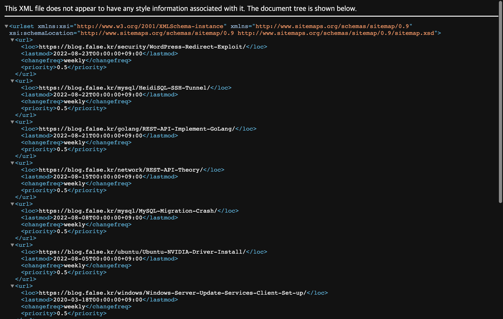
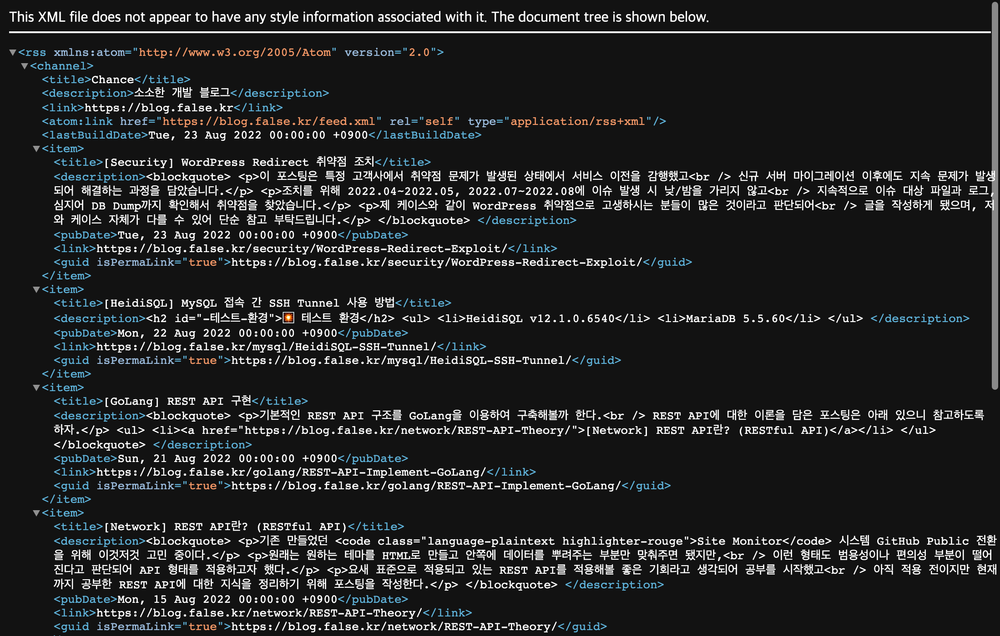

꽤나 많은 게시물을 작성했는데 구글 애널리틱스에서 접속자가 전혀 늘지 않았다.  
이유가 뭘까 생각했더니 블로그에 대한 등록 작업을 하지 않았구나 해서 진행했다.

## GitHub 블로그 내 Sitemap 만들기
Sitemap은 직역하자면 사이트의 지도로 사이트가 어떤 구조로 돼있는지 표현하게 된다.  
그렇기 때문에 웹 크롤러를 통해 내가 원하는 페이지를 노출시키는 목적으로 만들게 된다.

### _config.yml 파일 내 url 설정 확인하기
우선 _config.yml 파일에 url 설정 값이 비어있지는 않은지 내 URL이 맞는지 확인해야한다.  
이는 이후 작성할 sitemap에서 _config.yml에 기재된 url을 호출하기 때문에 꼭 확인해야한다.  

```yaml
# _config.yml
# 나는 블로그에 도메인을 할당했기에 아래와 같은 결과를 나타낸다.
# 만약에 기본 제공되는 도메인 사용 시 https://[사용자ID].github.io가 될 것이다.
url : "https://blog.false.kr"
```

### ROOT Path에 sitemap.xml 파일 추가하기
블로그 소스 중 ROOT(최상위) Path에 sitemap.xml 파일을 생성한다.  
생성한 파일에는 일반적으로 아래와 같이 내용을 작성하는 것으로 확인된다.  
(Default 값을 두고 만약 포스트에 해당 값 중 기입된 것이 있다면 반영한다.)

<script src="https://gist.github.com/ahs0432/a9e2cfc6a91194c2a3277c35726e98e4.js"></script>

여기에 표기된 내용 중 changefreq, priority가 무엇인지에 대한 의문이 들었다.  
priority는 우선 순위니까 포스팅 우선 순위일거 같은데 changefreq는 뭘까 싶었다.  

이에 대한 내용 확인 시 아래와 같은 내용이 확인되었다.

- changefreq
  - 해당 사이트 내에 저장된 콘텐츠(내용)가 변경되는 주기를 의미하고 있다.
  - 결론적으로 페이지가 ~마다 변경되니까 이때마다 크롤링 해달라는 것이다.
  - 관련 옵션을 정리해보니 아래와 같은 옵션들이 있다.
    - always : 접속 시 변경
    - hourly : 매시간 변경
    - daily : 매일 변경
    - weekly : 매주 변경
    - monthly : 매달 변경
    - yearly : 매년 변경
    - never : 변경 없음
- priority
  - 역시 말 뜻 그대로 우선 순위를 나타내고 있는 것으로 확인됐다.
  - 크롤링 봇에는 영향을 주지 않지만 URL 내 페이지 중 우선 순위를 결정한다.
  - 0.0~1.0 사이의 값을 선택하여 지정이 가능하고 기본 값은 0.5로 지정된다.

우리가 적용한 XML 콘텐츠는 기본 값으로 각각 weekly와 0.5을 갖도록 구현됐다.  
만약 콘텐츠마다 값을 주고 싶은 경우 아래와 같이 포스트 최상단에 기입하면 된다.

```markdown
---
... title 등의 콘텐츠는 생략했다.
sitemap:
  changefreq: daily
  priority : 1.0
...
---
```

적용하고 Build한 뒤 https://[블로그 도메인]/sitemap.xml에 접속하게 되면  
사진처럼 우리가 기입한 XML 내용에 따라 반영된 XML 페이지를 확인할 수 있다.

{: width="90%" height="90%"}{: .align-center}

## GitHub 블로그 내 robots.txt 만들기
robots.txt 파일은 크롤러가 엑세스할 수 있는 파일을 제어할 때 사용한다.  
여기서 작성 및 구성되는 각 규칙은 대상 경로에 엑세스 허용/차단 역할을 한다.

### ROOT Path에 robots.txt 파일 추가하기
마찬가지로 블로그 소스 중 ROOT(최상위) Path에 robots.txt 파일을 생성한다. 

```
User-agent: *
Allow: /

Sitemap: https://[블로그 도메인]/sitemap.xml
```

따로 차단할 것은 없고 사이트맵이 어디인지 알려주기 위해 상위와 같이 설정했다.  
차단이 필요한 경우 `Disallow: /foo/bar/` 이런 형식으로 내용을 추가하면 된다.

## GitHub 블로그 내 RSS feed 만들기
RSS Feed도 이용할 수 있도록 feed.xml 파일도 추가해두도록 하겠다.  
RSS Feed는 RSS 리더를 이용하여 최신 콘텐츠 게시 등의 알람을 받는다.

### ROOT Path에 feed.xml 파일 추가하기
크게 사용될 것 같지는 않지만 혹시나 나중에 잘 쓰일 수도 있으니 설정하겠다.

<script src="https://gist.github.com/ahs0432/7af58f56da9da5ed7ef63eceb4ae0c38.js"></script>

적용하고 Build한 뒤 https://[블로그 도메인]/feed.xml에 접속하게 되면  
사진처럼 블로그 포스팅 내용으로 RSS Feed 값이 만들어진 것이 확인된다.

{: width="90%" height="90%"}{: .align-center}

## Google Search Console에 사이트 등록하기
Google은 검색 서비스를 위해서 웹 크롤러를 이용하여 공개된 웹 페이지를 검색하게 된다.  
검색된 사이트의 콘텐츠를 렌더링하고 색인을 생성하여 최종적으로 사용자에게 제공하게 된다.

자세한 동작 방법은 [Google 검색의 작동 방식](https://www.google.com/intl/ko/search/howsearchworks/)에 기재된 내용을 참고하여 확인할 수 있다.

### Google Search 도메인 등록
먼저 [Google Search Console](https://search.google.com/search-console)에 접속한 뒤 등록하고자 하는 방법을 선택한다.  
나는 내 도메인으로 블로그를 운영하기 때문에 DNS 인증으로 진행하게 됐다.  

만약 GitHub 도메인으로 사용할 시 URL 접두어로 Hash(HTML) 인증을 진행한다.

{: width="90%" height="90%"}{: .align-center}

도메인 인증 후 추가가 완료됐다면 개요 페이지에 접근된다.  
나는 이미 추가된 상태여서 검색 결과 클릭 수가 표기되고 있다.

{: width="90%" height="90%"}{: .align-center}

좌측에서 Sitemaps로 이동하여 새 사이트맵 추가에 사이트맵 주소를 입력한다.  
만약 등록된 페이지에 이상이 없다면 사진과 같이 상태가 정상으로 표기된다.

{: width="90%" height="90%"}{: .align-center}

이후 `site:[블로그 도메인]`을 Google에 검색하게 되면 현재 색인 상태를 볼 수 있다.

{: width="90%" height="90%"}{: .align-center}

나는 아직 3일 밖에 지나지 않아 표기되지 않고 있는거 같다..

---

앞으로 블로그를 조금 더 열심히 해보기 위해서 웹 크롤링이 가능하게 등록했다.  
웹 크롤러에서 콘텐츠를 잘 확인해서 다양한 사람들에게 블로그가 표기됐으면 좋겠다.

끝까지 포스팅을 읽어주셔서 감사드리며, 틀린 내용이 있다면 댓글 부탁드립니다. 😎