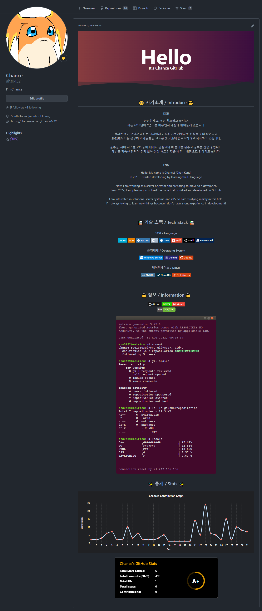
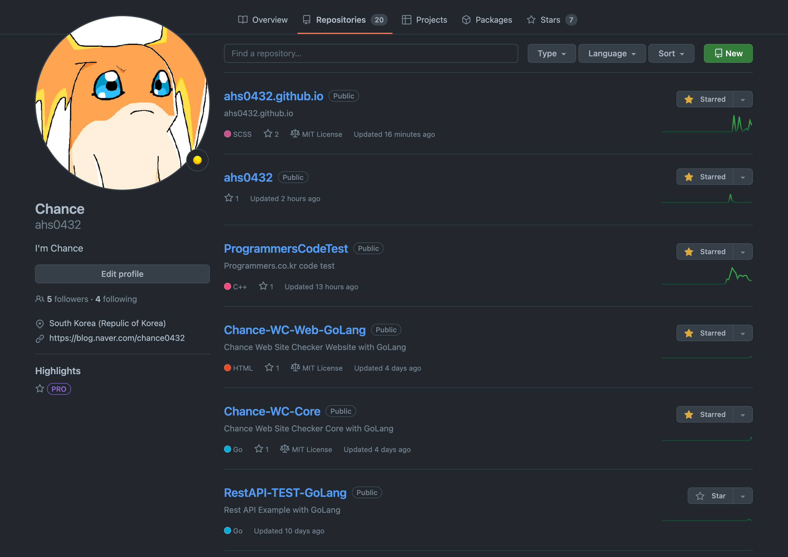
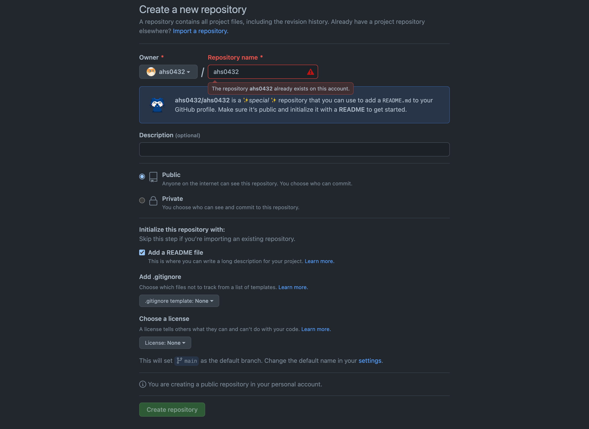
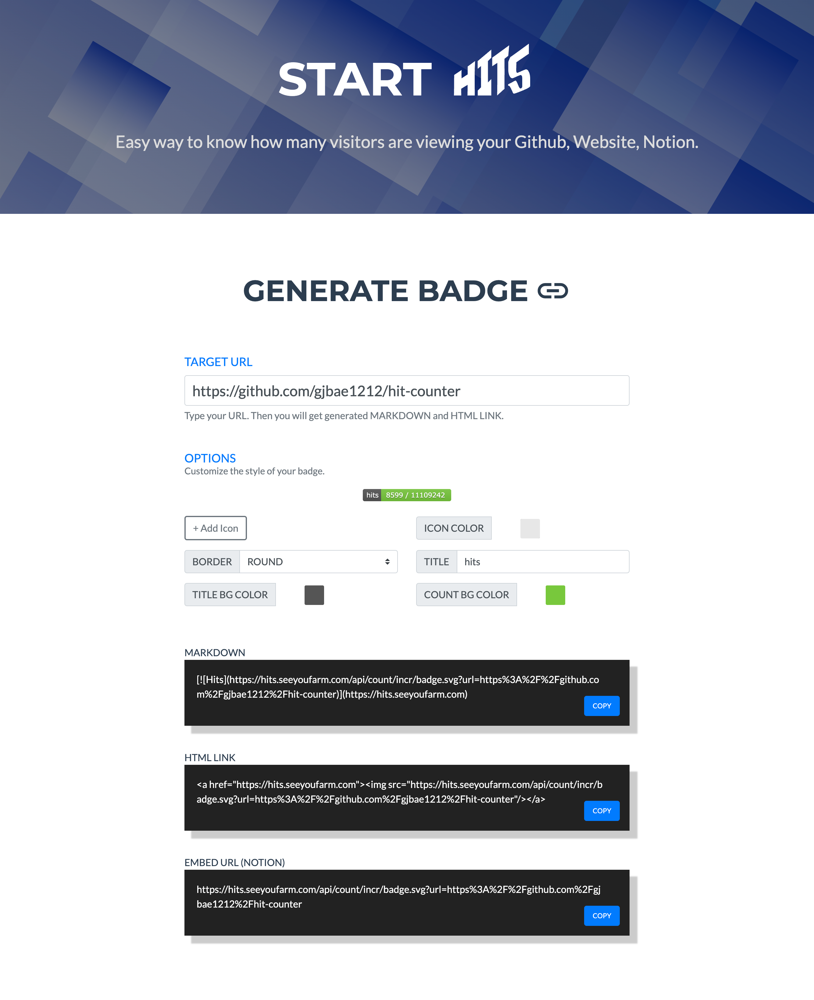
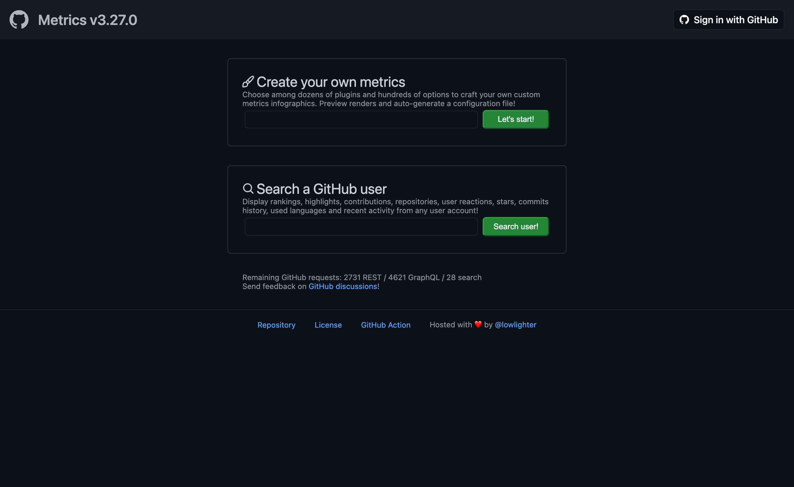
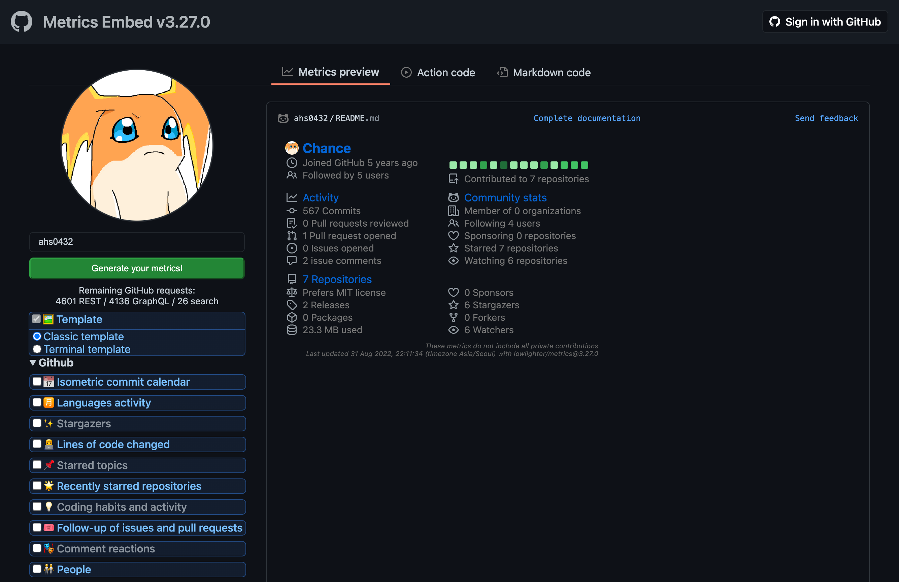

## 🎉 서론
**2020년 7월** GitHub에서는 메인 화면인 Overview 페이지에 Profile 기능을 출시했다.  
이렇게 출시된 기능을 이용하여 GitHub Profile을 꾸며두었는데 이를 소개할까 한다.

기능에 대해서 공식 문서가 궁금하다면 [GitHub(About your profile)](https://docs.github.com/en/account-and-profile/setting-up-and-managing-your-github-profile/customizing-your-profile/about-your-profile)를 참고 바란다.  
아래는 내가 포스팅에 작성할 내용을 종합하여 만들어본 나의 GitHub Profile이다.

{: width="90%" height="90%"}{: .align-center}  
(솔직히 엄청 기~인 편이고 내용을 줄이고 싶은데 하나같이 개성있어 보여서 하하..)

## ✨ 설정 방법
### 1. 자신의 Username과 동일한 저장소 생성

Repositories로 이동 후 우측 상단에 위치한 `New`를 클릭하여 이동한다.
{: width="90%" height="90%"}{: .align-center} 

자신의 계정명(Username)과 동일하게 저장소 명을 지정한 뒤 확인한다.  
확인했을 때 사진과 같이 고양이가 나와 특별한 저장소로 사용 됨을 알려준다.  
(나는 이미 해당 명칭의 저장소를 사용 중이기 때문에 오류 문구가 확인된다.)

`Add a README file`을 체크하고, `Create repository`를 클릭한다.

{: width="90%" height="90%"}{: .align-center} 

정상적이라면 Repositories에 자신의 계정명과 동일한 저장소가 생성된다.

### 2. README.md 파일을 원하는대로 수정하기
저장소가 생성됐다면 이제 내가 원하는대로 README.md 파일에 작성만 하면 된다.  
기본적으로 `.md` 확장자를 갖고 있는 만큼 유행하는 마크다운 형식을 지원하고 있다.

나는 작성 전 이미 Notion에서 마크다운을 경험한 적이 있었기에 편하게 사용했다.  
나중에 기회가 된다면 마크다운 언어에 대해서 조금 정리하여 작성해보도록 하겠다.

이번 포스팅에서는 내 Profile에 담긴 여러가지 요소에 대해서 소개해보겠다.

#### 💥 Capsule render
첫 번째 소개할 것은 Profile 최상단에 작성해둔 Capsule render이다.  
이것을 이용해 멋진 효과를 만들어서 내 Profile을 보는 사용자를 맞이할 수 있다.

예를 들어 간단하게 사용자에게 파란색 배경으로 Hello world!라고 띄우고 싶다면  
아래와 같이 마크다운에서 호출하는 URL에 쿼리를 변경하여 표현할 수 있게 된다.

```markdown

```
  
나는 웨이브 효과, 글자색 조정 등의 기능을 이용하여 아래와 같이 작성해두었다.

```markdown

```


여러가지 색깔이나 효과를 이용해서 다양한 연출이 가능하고 내가 원하는 글을 쓸 수 있다.  
난 이것을 이용해서 페이지에 접근했을 때 간단한 인사를 보여주도록 최상단에 위치시켰다.

Capsule render를 사용하는 자세한 방법은 kyechan99님의 [GitHub](https://github.com/kyechan99/capsule-render)을 참고하도록 하자.

#### 🌞 shields.io
두 번째 소개할 것은 여러 아이콘을 만들어 사용할 수 있는 [shields.io](https://shields.io/) 이다.  
내가 사용하는 언어 뿐만 아니라 굉장히 많은 아이콘을 만들어서 사용할 수 있다.

여기서 사용하는 언어 등의 로고는 [Simple Icons](https://simpleicons.org/)에서 확인하여 사용할 수 있다.  
이를 정리하여 사용하면 간단하게 로고가 있는 아이콘은 아래와 같이 만들 수 있다.
```markdown

```

GoLang의 로고와 트레이드 컬러를 이용해 아이콘 제작 시 아래처럼 만들어진다.

```markdown

```


이에 대한 옵션은 [shields.io](https://shields.io/) 사이트 하단에 위치해있으니 참고하면 된다.

#### 🏓 Hits
세 번째 소개할 것은 현재 페이지의 조회수를 확인하는 [Hits](https://hits.seeyoufarm.com/) 기능이다.

사용 방법은 사이트에서 대상 사이트를 Target URL로 설정해주면 된다.  
Option은 자신의 입맛에 맞게 변경하고 아래 용도에 맞게 결과물을 가져온다.

{: width="90%" height="90%"}{: .align-center} 

나는 현재 게시물의 URL을 넣어 만들었고 결과물은 아래와 같이 나오게 됐다.
```markdown
[](https://hits.seeyoufarm.com)
```
[](https://hits.seeyoufarm.com)

이걸 이용하면 조회수를 보이길 원하는 페이지에 적용하여 어디서든 사용 가능하다.

#### 📚 Lecoq Metrics
네 번째 소개할 것은 Stats과 얼마나 활동을 했는지 나타내주는 [Lecoq Metrics](https://metrics.lecoq.io/)이다. 

사용 방법은 사이트에서 Create your own metrics에 GitHub username을 입력한다.

{: width="90%" height="90%"}{: .align-center} 

이렇게 출력되는 화면에서 자신이 원하는 설정에 맞게 수정하여 반영하면 된다.

{: width="90%" height="90%"}{: .align-center} 

반영한 뒤 각 형태에 따라 Action code, Markdown code를 확인하면 된다.  
각 코드를 복사하여 Profile에 반영하게 되면 아래와 같이 반영될 수 있다.  
(나는 여러가지를 수정하여 아래처럼 특이한 이펙트가 나오게끔 해두었다.)

```markdown

```

  
~~(터미널.. 뭔가 특이하고 개성 있어 보여...)~~

#### 📈 Activity Graph
다섯 번째 소개할 것은 활동 그래프를 보여주는 [Activity Graph](https://github.com/ashutosh00710/github-readme-activity-graph)이다.

사용 방법은 아래 URL에 자신의 GitHub username을 적어서 사용할 수 있다.  
또한 기본 테마 이외 다른 것을 사용하고 싶은 경우 이를 지정하여 사용할 수 있다.

```markdown
[](https://github.com/ashutosh00710/github-readme-activity-graph)
```

나는 아래처럼 Profile에 xcode 테마를 적용하여 내 활동 그래프를 작성했다.

```markdown
[](https://github.com/ashutosh00710/github-readme-activity-graph)
```

[](https://github.com/ashutosh00710/github-readme-activity-graph)

사용하는 자세한 방법은 Ashutosh00710님의 [GitHub](https://github.com/ashutosh00710/github-readme-activity-graph)을 참고하도록 하자.

#### 🗂 Stats
마지막은 Commit, Pull Request, Issue 등을 검사하여 등급을 매기는 [Stats](https://github.com/anuraghazra/github-readme-stats)이다.

사용 방법은 아래 URL에 자신의 GitHub username을 적어서 사용할 수 있다.  
또한 기본 테마 이외 다른 것을 사용하고 싶은 경우 이를 지정하여 사용할 수 있다.  
~~(작성하고보니 위랑 같은 내용인데 놀랍게도 복붙한게 아니다.. 하하)~~

```markdown

```

나는 아래처럼 Profile에 Dark 테마를 적용하여 내 등급을 확인하였다.


---

이렇게 내가 Profile을 작성하면서 사용한 것들을 정리해보았다.  
너무 어지러워서 나중에는 정리할거 같은데 혹시 필요하면 참고하자.  

끝까지 포스팅을 읽어주셔서 감사드리며, 틀린 내용이 있다면 댓글 부탁드립니다. 😎