> 기본적인 REST API 구조를 GoLang을 이용하여 구축해볼까 한다.  
> REST API에 대한 이론을 담은 포스팅은 아래 있으니 참고하도록 하자.  
> * [[Network] REST API란? (RESTful API)](https://blog.false.kr/network/REST-API-Theory/)

# 🔧 REST API 구현 - GoLang
## 💼 구현 환경 및 프로그램
- GoLang 1.18
- Postman 9.27.2

## 📁 사용 Directory 구성
```bash
$ mkdir RESTAPI
$ cd RESTAPI
$ go mod init
```
- RESTAPI 구현 간 사용할 Directory를 생성하고 대상 디렉토리 내 Module을 초기화 해준다.

## 📕 GoLang net/http 패키지를 이용한 페이지 출력
```bash
$ type NUL > main.go
```
- 우선 기본적으로 사용할 main.go 파일을 만들어준다.

```go
// main.go
package main

import "net/http"

func main() {
  http.ListenAndServe(":80", nil)
}
```
- 만든 파일 내에 기본 함수 선언 및 net/http 패키지를 Import하였다.
- :80 포트로 Listen, ServeMux는 DefaultServeMux(nil)을 사용한다.
- 이렇게 작성된 코드를 실행할 경우 현재 PC의 80 포트를 점유하게된다.

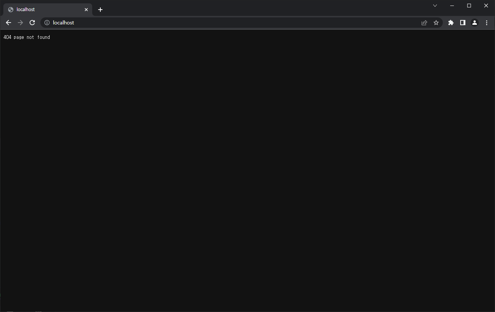{: width="90%" height="90%"}{: .align-center}
- 접근 사이트는 사진과 같이 Routing된 내용이 없어 404 Error가 발생된다.

```go
// main.go
package main

import "net/http"

func main() {
  http.HandleFunc("/", func(writer http.ResponseWriter, req *http.Request) {
    writer.Write([]byte("Hello World!!!"))
  })

  http.ListenAndServe(":80", nil)
}
```
- DefaultServeMux를 사용하기에 동작 확인을 위해서 HandleFunc을 작성한다.
- `/` Path로 접근했을 경우 `Hello World!!!`가 출력되도록 Route를 구성했다.

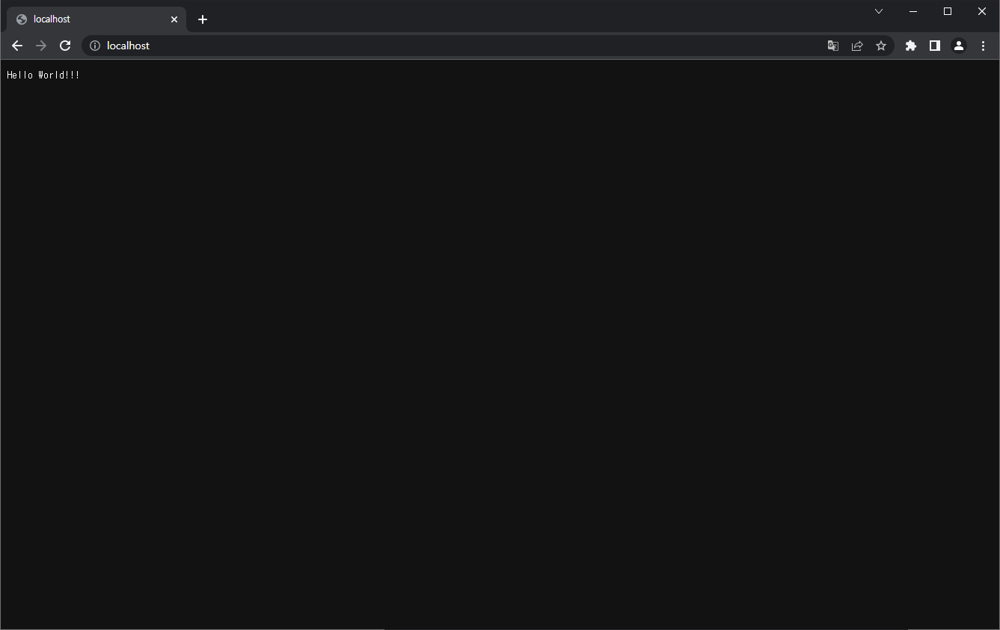{: width="90%" height="90%"}{: .align-center}
- 위와 같은 구성 시 `Hello World!!!`가 정상 출력되는 것을 확인할 수 있다.

## 📗 GoLang httprouter 패키지 이용
여기서 httprouter를 이용하는 이유는 아래와 같이 두 가지가 있다.
1. 사용자의 ID 값을 URI를 이용하여 전달하기에 필수로 URI 인식이 필요했다.
2. 최대 검색 값 등의 정보를 전달하기 위해서 Parameter 인식이 필요했다.

```bash
$ go get github.com/julienschmidt/httprouter
```
- 우선 httprouter 패키지를 이용하기 위해 `go get`을 이용하여 설치한다.

```go
package main

import (
  "net/http"

  "github.com/julienschmidt/httprouter"
)

func main() {
  router := httprouter.New()

  defaultGetHandle := httprouter.Handle(func(writer http.ResponseWriter, req *http.Request, param httprouter.Params) {
    writer.Write([]byte("Hello World!!!"))
  })

  router.GET("/", defaultGetHandle)
  http.ListenAndServe(":80", router)
}
```
- httprouter 패키지를 이용하여 `router` 변수를 ServeMux로 사용하기 위해 선언했다.
- httprouter에서 지원하는 Handle 선언 및 변수로 선언하고 이를 GET 요청에 할당했다.
- 그리고 net/http 패키지로 80 포트를 Listen하고 ServeMux로 router 변수를 지정했다.

{: width="90%" height="90%"}{: .align-center}
- 이렇게 작성한 코드를 실행하고 사이트 접근 시 이전과 같은 페이지가 확인된다.

## 📚 기본적인 REST API 구현

### 📑 변수, 구조체 및 함수 선언
```go
package main

import (
  "net/http"

  "github.com/julienschmidt/httprouter"
)

// 유저 정보 저장 JSON 형식
type User struct {
  NickName string `json:"nickname"`
  Email    string `json:"email"`
  Etc      string `json:"Etc"`
}

// 오류 코드 관리를 위한 JSON
type ErrorList struct {
  ErrorCode int    `json:"errorCode"`
  Message   string `json:"message"`
}

// User 임시 데이터
var users = map[int]*User{}
var lastIndex = 1

func main() {
	router := httprouter.New()

  /*
    GET, POST, PUT, DELETE, PATCH 기능 구현
    여기에 추가적인 구현 코드를 작성함.
  */

  // HTTP 포트 Listen
  http.ListenAndServe(":80", router)
}
```
1. 구조체
  - `User`  
    - 사용자의 정보(닉네임, 이메일, 기타사항)를 할당하기 위해 선언했다.
  - `ErrorList`  
    - Error 발생 간에 에러 코드와 메시지를 표현할 목적으로 선언했다.
2. 변수
  - `users`  
    - 데이터 보관 요소로 `User` 구조체를 이용하여 `map[int]*User` 타입으로 선언했다.  
    이 변수로 구현된 프로그램 실행 간 임시적으로 데이터 보관하여 동작을 확인한다.
  - `lastIndex`  
    - `users` 변수에 저장한 마지막 수 즉, Auto Increment를 구현하기 위해 선언했다.
3. 함수
  - 간단하게 테스트 구현만 하기 위함이므로 main() 함수만 선언했다.

### 📑 GET 요청 구현
GET 요청은 사용자가 지정한 자원과 자원의 ID를 기반으로 정보를 제공한다.  

정보 요청 시 사용자의 ID를 지정할 수도 있지만 지정하지 않는 경우도 존재하는데,  
이때는 해당 자원에 대한 모든 정보를 사용자에게 전달하는 방식으로 보통 사용된다.

원래는 RESTful하기 위해 HATEOAS 등을 구현해두어야 하는데 테스트이므로 생략하였다.

#### 📝 전체 정보 전달 요청 (GET /users)
```go
  // /user 페이지 GET 접근 시 전체 호출 확인
  usersGetHandle := httprouter.Handle(func(writer http.ResponseWriter, req *http.Request, param httprouter.Params) {
    writer.Header().Add("Content-Type", "application/json")

    // 기본 Limit 개수와 offset을 기본 값으로 설정해둠
    limit := 25
    offset := 1

    // URL 내 Query 값이 빈 값이 아닌 경우
    if req.URL.Query() != nil {
      reqQuery := req.URL.Query()

      // Limit Query를 확인하고 Integer 값이라면 1~25 내의 값인지 확인 후 반영
      _, exist := reqQuery["limit"]
      if exist {
        lmt, err := strconv.Atoi(reqQuery["limit"][0])
        if err != nil {
          writer.WriteHeader(http.StatusBadRequest)
          errorCode := ErrorList{ErrorCode: 400, Message: "Limit Query is not Integer."}
          json.NewEncoder(writer).Encode(errorCode)
        } else {
          if lmt > 0 && lmt <= 25 {
            limit = lmt
          } else {
            writer.WriteHeader(http.StatusBadRequest)
            errorCode := ErrorList{ErrorCode: 400, Message: "Limit Query value range is from 1 to 25."}
            json.NewEncoder(writer).Encode(errorCode)
            return
          }
        }
      }

      // Offset Query를 확인하고 Integer 값이라면 1~[lastindex] 내의 값인지 확인 후 반영
      _, exist = reqQuery["offset"]
      if exist {
        ofs, err := strconv.Atoi(reqQuery["offset"][0])
        if err != nil {
          writer.WriteHeader(http.StatusBadRequest)
          errorCode := ErrorList{ErrorCode: 400, Message: "Offset Query is not Integer."}
          json.NewEncoder(writer).Encode(errorCode)
        } else {
          if ofs > 0 && ofs < lastIndex {
            offset = ofs

          } else {
            writer.WriteHeader(http.StatusBadRequest)
            errorCode := ErrorList{ErrorCode: 400, Message: "Offset Query value range is from ~" + strconv.Itoa(lastIndex-1)}
            json.NewEncoder(writer).Encode(errorCode)
            return
          }
        }
      }
    }

    // offset + limit 값이 최대 값보다 큰 경우 불필요한 오버헤드를 방지하기 위해 계산.
    if (offset + limit - 1) > lastIndex {
      limit -= (lastIndex - (offset + limit))
    }

    // 현재 조회된 User 값을 보관할 Map을 하나 생성하고 For 문을 통해 대상 값의 유무 확인 후 Map 내에 담아 전달
    user := map[int]*User{}

    for i := offset; i < (offset + limit); i++ {
      u, exist := users[i]
      if exist {
        user[i] = u
      }
    }

    json.NewEncoder(writer).Encode(user)
  })
```
- 구현 내용 확인 시 JSON 형식으로 Content-Type을 변경하여 전달한다.  
  이부분이 생략되면 HTML 형식으로 내용을 전달하기에 꼭 추가해두도록 하자.
- 모든 정보 전달 시 발생되는 오버헤드나 부하를 생각하면 문제가 발생된다.  
  이때 개수 제한을 두는데 URI에 기재된 Query를 가져와 제한하도록 해두겠다.

#### 📝 대상 ID 정보 전달 요청 (GET /users/:idx)
```go
  // /user/[index] 페이지 GET 접근 시 대상 Index 유무 확인 및 사용자에게 데이터 전송
  userGetHandle := httprouter.Handle(func(writer http.ResponseWriter, req *http.Request, param httprouter.Params) {
    writer.Header().Add("Content-Type", "application/json")
    index, err := strconv.Atoi(param.ByName("idx"))

    // [index] 값이 Integer 값이 맞는지 확인 후 아닐 경우 400 에러 발생
    if err != nil {
      writer.WriteHeader(http.StatusBadRequest)
      errorCode := ErrorList{ErrorCode: 400, Message: param.ByName("idx") + "(Index) is not Integer."}
      json.NewEncoder(writer).Encode(errorCode)
    } else {
      user, exists := users[index]

      // [index] 값이 존재하는 값인지 여부를 확인하고 미존재 시 404 에러 발생 / 정상일 경우 사용자에게 출력
      if exists {
        json.NewEncoder(writer).Encode(user)
      } else {
        writer.WriteHeader(http.StatusNotFound)
        errorCode := ErrorList{ErrorCode: 404, Message: param.ByName("idx") + "(Index) is not Found."}
        json.NewEncoder(writer).Encode(errorCode)
      }
    }
  })
```
- `:idx` 값 이용 시 사용자 정보가 존재하는지 확인 후 정보를 제공한다.
- `:idx`가 정수형이 아니면 400, 없는 값인 경우 404 오류를 발생시키도록 구현했다.

### 📑 POST 요청 구현
POST 요청은 사용자가 지정한 자원에 정보를 추가하는 형식으로 사용된다.

#### 📝 자원에 정보 추가 요청 (POST /users)
```go
  // /user 페이지 POST 접근 시 Last Index로 추가
  userPostHandle := httprouter.Handle(func(writer http.ResponseWriter, req *http.Request, param httprouter.Params) {
    writer.Header().Add("Content-Type", "application/json")

    var user User
    // HTTP 요청을 수신받아 Decode 하여 User Struct에 변수로 입력
    json.NewDecoder(req.Body).Decode(&user)

    // 필수 컨텐츠 존재 여부 확인 후 미존재 시 400 에러 발생
    if user.Email == "" {
      writer.WriteHeader(http.StatusBadRequest)
      errorCode := ErrorList{ErrorCode: 400, Message: "Required element(Email) is null."}
      json.NewEncoder(writer).Encode(errorCode)
    } else if user.NickName == "" {
      writer.WriteHeader(http.StatusBadRequest)
      errorCode := ErrorList{ErrorCode: 400, Message: "Required element(NickName) is null."}
      json.NewEncoder(writer).Encode(errorCode)
    } else {
      // 문제 없을 경우 현재 Index에 값 추가 후 인덱스 값을 늘림
      users[lastIndex] = &user
      lastIndex++

      writer.WriteHeader(http.StatusCreated)
      json.NewEncoder(writer).Encode(user)
    }
  })
```
- 사용자가 Body에 입력한 JSON을 기반으로 `users` 변수에 정보를 추가한다.
- Auto Increment 구현을 위해 값이 추가되면 `lastIndex` 변수에 1을 추가한다.
- 필수 값으로 닉네임과 이메일을 받아야 하기에 빈 값이면 400 오류를 발생시켰다.

### 📑 PUT 요청 구현
PUT 요청은 사용자가 대상 자원 ID를 지정하고 정보를 교체하는 형식으로 사용된다.  
일부 자원만 교체가 불가하며 전체 자원이 모두 교체되는 형식이라는 것을 참고하자.

정보 교체 내용 중 null 값이나 기재되지 않은 필드가 있을 시 기본 값으로 대체한다.  
일부 자원만 교체하길 원하면 PATCH 요청을 수행하는데 이는 아래에서 서술하겠다.

#### 📝 대상 ID 정보 수정 요청 (전체 값 수정) (PUT /users/:idx)
```go
  // /user/[index] 페이지 PUT 접근 시 대상 Index 유무 확인 및 사용자 데이터 수정 후 수정된 데이터 전달
  userPutHandle := httprouter.Handle(func(writer http.ResponseWriter, req *http.Request, param httprouter.Params) {
    writer.Header().Add("Content-Type", "application/json")
    index, err := strconv.Atoi(param.ByName("idx"))

    // [index] 값이 Integer 값이 맞는지 확인 후 아닐 경우 400 에러 발생
    if err != nil {
      writer.WriteHeader(http.StatusBadRequest)
      errorCode := ErrorList{ErrorCode: 400, Message: param.ByName("idx") + "(Index) is not Integer."}
      json.NewEncoder(writer).Encode(errorCode)
    } else {
      _, exists := users[index]

      // [index] 값이 존재하는 값인지 여부를 확인하고 미존재 시 404 에러 발생
      if exists {
        var user User
        json.NewDecoder(req.Body).Decode(&user)

        // 필수 값의 경우 비워두면 기본 값이 없기에 오류 발생 (Email, NickName) / 문제 없을 시 이외 값은 기본 값으로 지정하여 변경 진행
        if user.Email == "" {
          writer.WriteHeader(http.StatusBadRequest)
          errorCode := ErrorList{ErrorCode: 400, Message: "Required element(Email) is null."}
          json.NewEncoder(writer).Encode(errorCode)
        } else if user.NickName == "" {
          writer.WriteHeader(http.StatusBadRequest)
          errorCode := ErrorList{ErrorCode: 400, Message: "Required element(NickName) is null."}
          json.NewEncoder(writer).Encode(errorCode)
        } else {
          users[index] = &user
          json.NewEncoder(writer).Encode(users[index])
        }
      } else {
        writer.WriteHeader(http.StatusNotFound)
        errorCode := ErrorList{ErrorCode: 404, Message: param.ByName("idx") + "(Index) is not Found."}
        json.NewEncoder(writer).Encode(errorCode)
      }
    }
  })
```
- `:idx`에 해당하는 자원의 정보를 값에 문제 없을 시 기재된 값으로 교체한다.  
  만약 기재된 값이 없는 경우 기본 값으로 지정된 값(Etc = "")으로 변경한다.
- `:idx`가 정수형이 아니면 400, 없는 값인 경우 404를 발생시키도록 구현했다.
- 필수 값인 닉네임, 이메일은 기본 값이 없기 때문에 빈 값일 경우 문제가 발생되어  
  이를 방지하기 위해서 두 값은 기재되지 않은 경우 400 오류가 발생되도록 했다.

### 📑 DELETE 요청 구현
DELETE 요청은사용자가 대상 자원 ID를 지정하고 정보를 삭제하는 형식으로 사용된다.

#### 📝 대상 ID 정보 삭제 요청 (DELETE /users/:idx)
```go
  // /user/[index] 페이지 DELETE 접근 시 대상 Index 유무 확인 및 사용자 데이터 삭제 후 삭제된 데이터 전달
  userDeleteHandle := httprouter.Handle(func(writer http.ResponseWriter, req *http.Request, param httprouter.Params) {
    writer.Header().Add("Content-Type", "application/json")
    index, err := strconv.Atoi(param.ByName("idx"))

    // [index] 값이 Integer 값이 맞는지 확인 후 아닐 경우 400 에러 발생
    if err != nil {
      writer.WriteHeader(http.StatusBadRequest)
      errorCode := ErrorList{ErrorCode: 400, Message: param.ByName("idx") + "(Index) is not Integer."}
      json.NewEncoder(writer).Encode(errorCode)
    } else {
      user, exists := users[index]

      // [index] 값이 존재하는 값인지 여부를 확인하고 미존재 시 404 에러 발생 / 정상일 경우 데이터 삭제 후 삭제한 데이터 출력
      if exists {
        delete(users, index)
        json.NewEncoder(writer).Encode(user)
      } else {
        writer.WriteHeader(http.StatusNotFound)
        errorCode := ErrorList{ErrorCode: 404, Message: param.ByName("idx") + "(Index) is not Found."}
        json.NewEncoder(writer).Encode(errorCode)
      }
    }
  })
```
- `:idx` 값을 검색하여 사용자 정보가 존재하는지 확인 후 정보를 삭제한다.
- `:idx`가 정수형이 아니면 400, 없는 값인 경우 404 오류를 발생시키도록 구현했다.

### 📑 PATCH 요청 구현
여태까지 GET, POST, PUT, DELETE Method만 설명했는데 이건 뭔가 싶을거다.  

여러 구현 형태를 보다가 PUT은 전체 필드 값 교체를 위해 사용한다는 것을 확인했다.  
그렇다면 기재 필드만 교체하는 것은 무엇이 있을지 찾아보다 PATCH Method를 찾았다.

즉, POST 요청은 기재된 필드 및 값만 검사하고 교체하게 되는 형태라고 보면 된다.

#### 📝 대상 ID 정보 수정 요청 (기재 값만 수정) (PATCH /users/:idx)
```go
  // /user/[index] 페이지 PATCH 접근 시 대상 Index 유무 확인 및 수정 요청 값에 대해서만 수정 후 수정된 데이터 전달
  userPatchHandle := httprouter.Handle(func(writer http.ResponseWriter, req *http.Request, param httprouter.Params) {
    writer.Header().Add("Content-Type", "application/json")
    index, err := strconv.Atoi(param.ByName("idx"))

    // [index] 값이 Integer 값이 맞는지 확인 후 아닐 경우 400 에러 발생
    if err != nil {
      writer.WriteHeader(http.StatusBadRequest)
      errorCode := ErrorList{ErrorCode: 400, Message: param.ByName("idx") + "(Index) is not Integer."}
      json.NewEncoder(writer).Encode(errorCode)
    } else {
      _, exists := users[index]

      // [index] 값이 존재하는 값인지 여부를 확인하고 미존재 시 404 에러 발생 / 정상일 경우 데이터 삭제 후 삭제한 데이터 출력
      if exists {
        var user User
        json.NewDecoder(req.Body).Decode(&user)

        // 변경된 것이 있는지 확인하는 변수
        changeCheck := false

        // Email, NickName, Etc 중 변경 요청 값만 변경하고 변경됐다면 changeCheck 변수에 반영
        if user.Email != "" {
          users[index].Email = user.Email
          changeCheck = true
        }

        if user.NickName != "" {
          users[index].NickName = user.NickName
          changeCheck = true
        }

        if user.Etc != "" {
          users[index].Etc = user.Etc
          changeCheck = true
        }

        // 하나의 값도 변경되지 않았다면 400 에러 발생 / 정상인 경우 변경 이후 데이터 출력
        if changeCheck {
          json.NewEncoder(writer).Encode(users[index])
        } else {
          writer.WriteHeader(http.StatusBadRequest)
          errorCode := ErrorList{ErrorCode: 400, Message: "All element is null."}
          json.NewEncoder(writer).Encode(errorCode)
        }
      } else {
        writer.WriteHeader(http.StatusNotFound)
        errorCode := ErrorList{ErrorCode: 404, Message: param.ByName("idx") + "(Index) is not Found."}
        json.NewEncoder(writer).Encode(errorCode)
      }
    }
  })
```
- `:idx`에 해당하는 자원의 정보를 값에 문제 없을 시 기재된 필드의 값만 교체한다.  
- `:idx`가 정수형이 아니면 400, 없는 값인 경우 404 오류를 발생시키도록 구현했다.  
  만약 교체되는 필드가 없는 경우에도 400 오류가 발생되도록 구현해두었다.

### 📑 Method 별 요청 처리 대상 지정
```go
  // 각 경로 별 GET, POST, PUT, DELETE, PATCH Method에 따른 처리 지정
  router.GET("/users", usersGetHandle)
  router.POST("/users", userPostHandle)

  router.GET("/users/:idx", userGetHandle)
  router.PUT("/users/:idx", userPutHandle)
  router.DELETE("/users/:idx", userDeleteHandle)
  router.PATCH("/users/:idx", userPatchHandle)
```
- 각 Method의 역할 및 경로에 맞게 route를 배치하여 처리되도록 설정했다.

### 📘 최종 종합 코드
여태까지 작성한 코드를 모두 합치면 아래와 같은 코드가 나오게 된다.

```go
package main

import (
  "encoding/json"
  "net/http"
  "strconv"

  "github.com/julienschmidt/httprouter"
)

// 유저 정보 저장 JSON 형식
type User struct {
  NickName string `json:"nickname"`
  Email    string `json:"email"`
  Etc      string `json:"Etc"`
}

// 오류 코드 관리를 위한 JSON
type ErrorList struct {
  ErrorCode int    `json:"errorCode"`
  Message   string `json:"message"`
}

// User 임시 데이터
var users = map[int]*User{}
var lastIndex = 1

func main() {
	router := httprouter.New()

  // /user 페이지 GET 접근 시 전체 호출 확인
  usersGetHandle := httprouter.Handle(func(writer http.ResponseWriter, req *http.Request, param httprouter.Params) {
    writer.Header().Add("Content-Type", "application/json")

    // 기본 Limit 개수와 offset을 기본 값으로 설정해둠
    limit := 25
    offset := 1

    // URL 내 Query 값이 빈 값이 아닌 경우
    if req.URL.Query() != nil {
      reqQuery := req.URL.Query()

      // Limit Query를 확인하고 Integer 값이라면 1~25 내의 값인지 확인 후 반영
      _, exist := reqQuery["limit"]
      if exist {
        lmt, err := strconv.Atoi(reqQuery["limit"][0])
        if err != nil {
          writer.WriteHeader(http.StatusBadRequest)
          errorCode := ErrorList{ErrorCode: 400, Message: "Limit Query is not Integer."}
          json.NewEncoder(writer).Encode(errorCode)
        } else {
          if lmt > 0 && lmt <= 25 {
            limit = lmt
          } else {
            writer.WriteHeader(http.StatusBadRequest)
            errorCode := ErrorList{ErrorCode: 400, Message: "Limit Query value range is from 1 to 25."}
            json.NewEncoder(writer).Encode(errorCode)
            return
          }
        }
      }

      // Offset Query를 확인하고 Integer 값이라면 1~[lastindex] 내의 값인지 확인 후 반영
      _, exist = reqQuery["offset"]
      if exist {
        ofs, err := strconv.Atoi(reqQuery["offset"][0])
        if err != nil {
          writer.WriteHeader(http.StatusBadRequest)
          errorCode := ErrorList{ErrorCode: 400, Message: "Offset Query is not Integer."}
          json.NewEncoder(writer).Encode(errorCode)
        } else {
          if ofs > 0 && ofs < lastIndex {
            offset = ofs

          } else {
            writer.WriteHeader(http.StatusBadRequest)
            errorCode := ErrorList{ErrorCode: 400, Message: "Offset Query value range is from ~" + strconv.Itoa(lastIndex-1)}
            json.NewEncoder(writer).Encode(errorCode)
            return
          }
        }
      }
    }

    // offset + limit 값이 최대 값보다 큰 경우 불필요한 오버헤드를 방지하기 위해 계산.
    if (offset + limit - 1) > lastIndex {
      limit -= (lastIndex - (offset + limit))
    }

    // 현재 조회된 User 값을 보관할 Map을 하나 생성하고 For 문을 통해 대상 값의 유무 확인 후 Map 내에 담아 전달
    user := map[int]*User{}

    for i := offset; i < (offset + limit); i++ {
      u, exist := users[i]
      if exist {
        user[i] = u
      }
    }

    json.NewEncoder(writer).Encode(user)
  })

  // /user 페이지 POST 접근 시 Last Index로 추가
  userPostHandle := httprouter.Handle(func(writer http.ResponseWriter, req *http.Request, param httprouter.Params) {
    writer.Header().Add("Content-Type", "application/json")

    var user User
    // HTTP 요청을 수신받아 Decode 하여 User Struct에 변수로 입력
    json.NewDecoder(req.Body).Decode(&user)

    // 필수 컨텐츠 존재 여부 확인 후 미존재 시 400 에러 발생
    if user.Email == "" {
      writer.WriteHeader(http.StatusBadRequest)
      errorCode := ErrorList{ErrorCode: 400, Message: "Required element(Email) is null."}
      json.NewEncoder(writer).Encode(errorCode)
    } else if user.NickName == "" {
      writer.WriteHeader(http.StatusBadRequest)
      errorCode := ErrorList{ErrorCode: 400, Message: "Required element(NickName) is null."}
      json.NewEncoder(writer).Encode(errorCode)
    } else {
      // 문제 없을 경우 현재 Index에 값 추가 후 인덱스 값을 늘림
      users[lastIndex] = &user
      lastIndex++

      writer.WriteHeader(http.StatusCreated)
      json.NewEncoder(writer).Encode(user)
    }
  })

  // /user/[index] 페이지 GET 접근 시 대상 Index 유무 확인 및 사용자에게 데이터 전송
  userGetHandle := httprouter.Handle(func(writer http.ResponseWriter, req *http.Request, param httprouter.Params) {
    writer.Header().Add("Content-Type", "application/json")
    index, err := strconv.Atoi(param.ByName("idx"))

    // [index] 값이 Integer 값이 맞는지 확인 후 아닐 경우 400 에러 발생
    if err != nil {
      writer.WriteHeader(http.StatusBadRequest)
      errorCode := ErrorList{ErrorCode: 400, Message: param.ByName("idx") + "(Index) is not Integer."}
      json.NewEncoder(writer).Encode(errorCode)
    } else {
      user, exists := users[index]

      // [index] 값이 존재하는 값인지 여부를 확인하고 미존재 시 404 에러 발생 / 정상일 경우 사용자에게 출력
      if exists {
        json.NewEncoder(writer).Encode(user)
      } else {
        writer.WriteHeader(http.StatusNotFound)
        errorCode := ErrorList{ErrorCode: 404, Message: param.ByName("idx") + "(Index) is not Found."}
        json.NewEncoder(writer).Encode(errorCode)
      }
    }
  })

  // /user/[index] 페이지 PUT 접근 시 대상 Index 유무 확인 및 사용자 데이터 수정 후 수정된 데이터 전달
  userPutHandle := httprouter.Handle(func(writer http.ResponseWriter, req *http.Request, param httprouter.Params) {
    writer.Header().Add("Content-Type", "application/json")
    index, err := strconv.Atoi(param.ByName("idx"))

    // [index] 값이 Integer 값이 맞는지 확인 후 아닐 경우 400 에러 발생
    if err != nil {
      writer.WriteHeader(http.StatusBadRequest)
      errorCode := ErrorList{ErrorCode: 400, Message: param.ByName("idx") + "(Index) is not Integer."}
      json.NewEncoder(writer).Encode(errorCode)
    } else {
      _, exists := users[index]

      // [index] 값이 존재하는 값인지 여부를 확인하고 미존재 시 404 에러 발생
      if exists {
        var user User
        json.NewDecoder(req.Body).Decode(&user)

        // 필수 값의 경우 비워두면 기본 값이 없기에 오류 발생 (Email, NickName) / 문제 없을 시 이외 값은 기본 값으로 지정하여 변경 진행
        if user.Email == "" {
          writer.WriteHeader(http.StatusBadRequest)
          errorCode := ErrorList{ErrorCode: 400, Message: "Required element(Email) is null."}
          json.NewEncoder(writer).Encode(errorCode)
        } else if user.NickName == "" {
          writer.WriteHeader(http.StatusBadRequest)
          errorCode := ErrorList{ErrorCode: 400, Message: "Required element(NickName) is null."}
          json.NewEncoder(writer).Encode(errorCode)
        } else {
          users[index] = &user
          json.NewEncoder(writer).Encode(users[index])
        }
      } else {
        writer.WriteHeader(http.StatusNotFound)
        errorCode := ErrorList{ErrorCode: 404, Message: param.ByName("idx") + "(Index) is not Found."}
        json.NewEncoder(writer).Encode(errorCode)
      }
    }
  })

  // /user/[index] 페이지 DELETE 접근 시 대상 Index 유무 확인 및 사용자 데이터 삭제 후 삭제된 데이터 전달
  userDeleteHandle := httprouter.Handle(func(writer http.ResponseWriter, req *http.Request, param httprouter.Params) {
    writer.Header().Add("Content-Type", "application/json")
    index, err := strconv.Atoi(param.ByName("idx"))

    // [index] 값이 Integer 값이 맞는지 확인 후 아닐 경우 400 에러 발생
    if err != nil {
      writer.WriteHeader(http.StatusBadRequest)
      errorCode := ErrorList{ErrorCode: 400, Message: param.ByName("idx") + "(Index) is not Integer."}
      json.NewEncoder(writer).Encode(errorCode)
    } else {
      user, exists := users[index]

      // [index] 값이 존재하는 값인지 여부를 확인하고 미존재 시 404 에러 발생 / 정상일 경우 데이터 삭제 후 삭제한 데이터 출력
      if exists {
        delete(users, index)
        json.NewEncoder(writer).Encode(user)
      } else {
        writer.WriteHeader(http.StatusNotFound)
        errorCode := ErrorList{ErrorCode: 404, Message: param.ByName("idx") + "(Index) is not Found."}
        json.NewEncoder(writer).Encode(errorCode)
      }
    }
  })

  // /user/[index] 페이지 PATCH 접근 시 대상 Index 유무 확인 및 수정 요청 값에 대해서만 수정 후 수정된 데이터 전달
  userPatchHandle := httprouter.Handle(func(writer http.ResponseWriter, req *http.Request, param httprouter.Params) {
    writer.Header().Add("Content-Type", "application/json")
    index, err := strconv.Atoi(param.ByName("idx"))

    // [index] 값이 Integer 값이 맞는지 확인 후 아닐 경우 400 에러 발생
    if err != nil {
      writer.WriteHeader(http.StatusBadRequest)
      errorCode := ErrorList{ErrorCode: 400, Message: param.ByName("idx") + "(Index) is not Integer."}
      json.NewEncoder(writer).Encode(errorCode)
    } else {
      _, exists := users[index]

      // [index] 값이 존재하는 값인지 여부를 확인하고 미존재 시 404 에러 발생 / 정상일 경우 데이터 삭제 후 삭제한 데이터 출력
      if exists {
        var user User
        json.NewDecoder(req.Body).Decode(&user)

        // 변경된 것이 있는지 확인하는 변수
        changeCheck := false

        // Email, NickName, Etc 중 변경 요청 값만 변경하고 변경됐다면 changeCheck 변수에 반영
        if user.Email != "" {
          users[index].Email = user.Email
          changeCheck = true
        }

        if user.NickName != "" {
          users[index].NickName = user.NickName
          changeCheck = true
        }

        if user.Etc != "" {
          users[index].Etc = user.Etc
          changeCheck = true
        }

        // 하나의 값도 변경되지 않았다면 400 에러 발생 / 정상인 경우 변경 이후 데이터 출력
        if changeCheck {
          json.NewEncoder(writer).Encode(users[index])
        } else {
          writer.WriteHeader(http.StatusBadRequest)
          errorCode := ErrorList{ErrorCode: 400, Message: "All element is null."}
          json.NewEncoder(writer).Encode(errorCode)
        }
      } else {
        writer.WriteHeader(http.StatusNotFound)
        errorCode := ErrorList{ErrorCode: 404, Message: param.ByName("idx") + "(Index) is not Found."}
        json.NewEncoder(writer).Encode(errorCode)
      }
    }
  })

  // 각 경로 별 GET, POST, PUT, DELETE, PATCH 메소드에 따른 처리 지정
  router.GET("/users", usersGetHandle)
  router.POST("/users", userPostHandle)

  router.GET("/users/:idx", userGetHandle)
  router.PUT("/users/:idx", userPutHandle)
  router.DELETE("/users/:idx", userDeleteHandle)
  router.PATCH("/users/:idx", userPatchHandle)

  // HTTP 포트 Listen
  http.ListenAndServe(":80", router)
}
```

## 🛫 동작 테스트
작성된 코드를 실행하여 HTTP를 Listen 시키고 Postman으로 확인해보겠다.  
Postman 개발한 API를 테스트하고 그 결과를 공유, 보관할 수 있는 플랫폼이다.

### 🎇 POST 요청 테스트 (POST /users)
우선 모든 요청을 테스트해보기 위해선 정보가 필요하고 POST를 이용하여 추가하겠다.

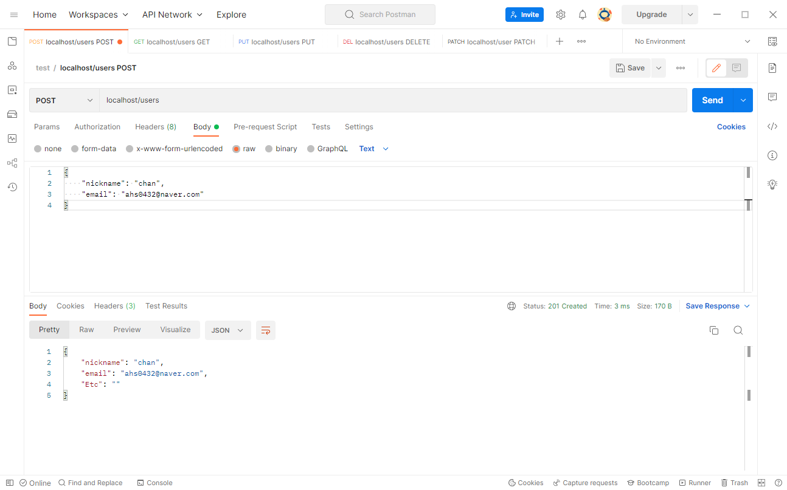{: width="90%" height="90%"}{: .align-center}

```JSON
{
    "nickname": "chan",
    "email": "ahs0432@naver.com"
}
```
- 내가 추가할 값은 위와 같은 JSON 형태의 값이다.

```JSON
{
    "nickname": "chan",
    "email": "ahs0432@naver.com",
    "Etc": ""
}
```
- 정상적으로 작업이 수행되고 결과 값으로 상위와 같은 JSON을 받았다.

### 🎫 GET 요청 테스트
#### 👉 전체 (GET /users)
GET 요청으로 현재 추가된 결과를 전체로 조회해보도록 하겠다.

{: width="90%" height="90%"}{: .align-center}
- 현재 상태에서는 정보가 1개 뿐이기 때문에 제한 값을 확인할 수 없다.
- 그래서 POST를 이용해서 30개의 정보를 동일 값으로 지정하여 추가하였다.

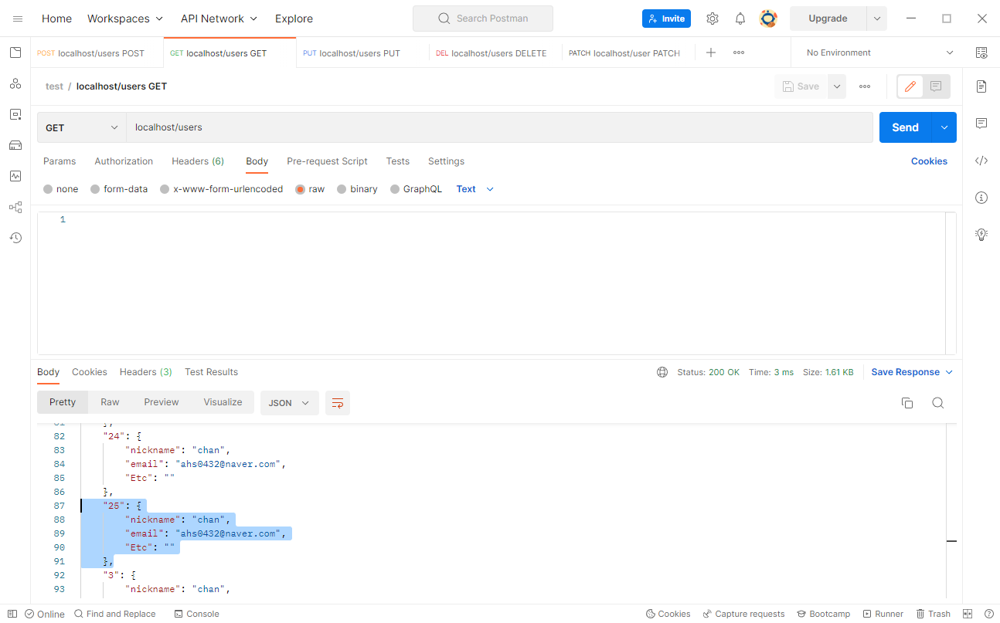{: width="90%" height="90%"}{: .align-center}
- 이렇게 조회할 경우 현재 offset이 기본 값(1)이므로 1부터 25개가 조회된다.

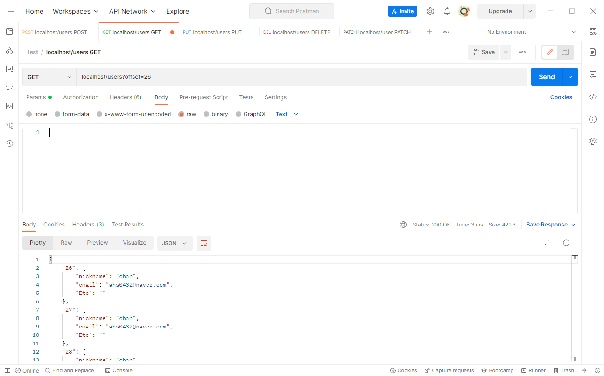{: width="90%" height="90%"}{: .align-center}
- 나머지 5개는 offset을 26부터로 지정할 경우 확인이 가능하다.

{: width="90%" height="90%"}{: .align-center}
- 또한 내가 25개가 너무 많다고 판단될 경우 줄이는 것도 가능하다.

이제 여기에 HATEOAS 값을 지정하여 추가하면 더 RESTful해질 것 같다.

#### 👉 대상 (GET /users/:idx)
GET 요청으로 자원 ID 값에 해당하는 정보를 조회해보도록 하겠다.

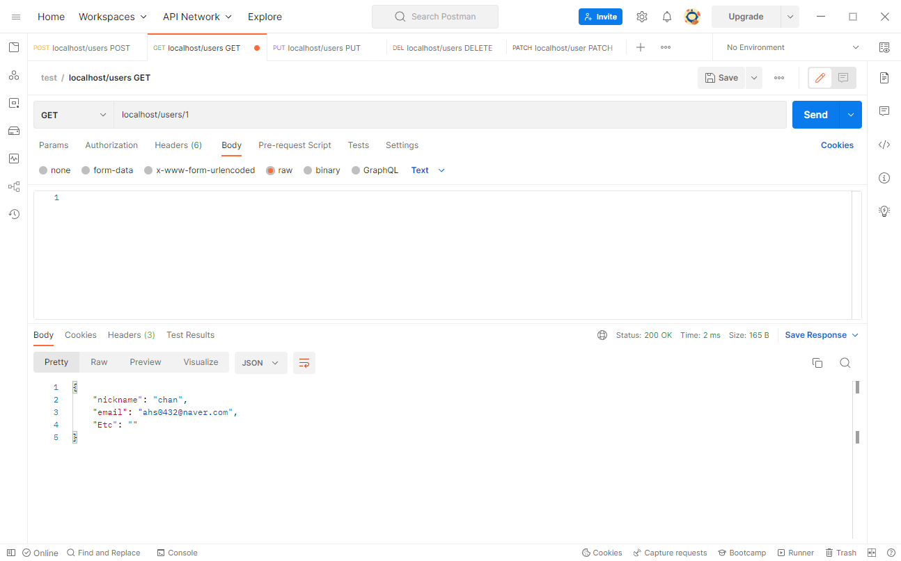{: width="90%" height="90%"}{: .align-center}
- 자원 ID에 값만 존재한다면 사진과 같이 정상적으로 값이 조회된다.

{: width="90%" height="90%"}{: .align-center}
- 만약 31번과 같이 존재하지 않는 자원 ID를 조회할 경우 오류가 발생된다.

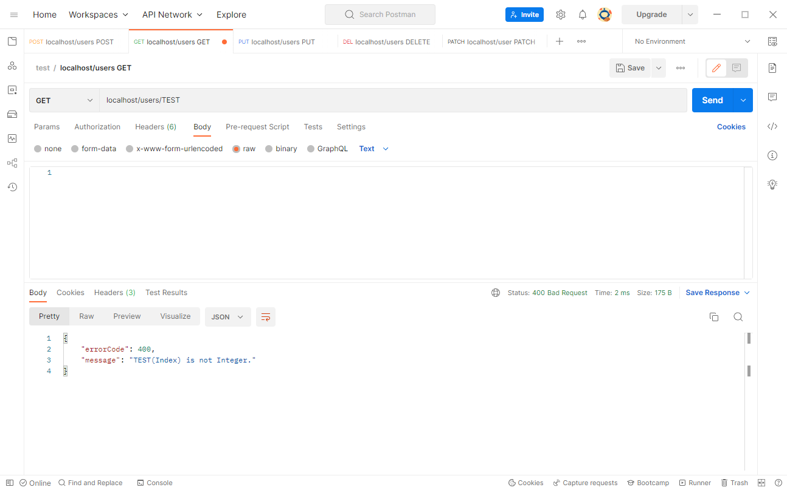{: width="90%" height="90%"}{: .align-center}
- 또한 ID 값이 정수 값이 아닌 경우에도 오류가 발생된다.

### 📝 PUT 요청 테스트 (PUT /users/:idx)
PUT 요청을 이용해서 자원을 교체하고 어떻게 교체되는지 확인해보겠다.

{: width="90%" height="90%"}{: .align-center}

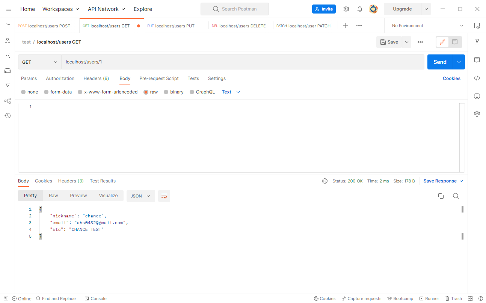{: width="90%" height="90%"}{: .align-center}
- 1번 ID를 가진 자원을 필드 내용을 교체한 뒤 조회해보았다.

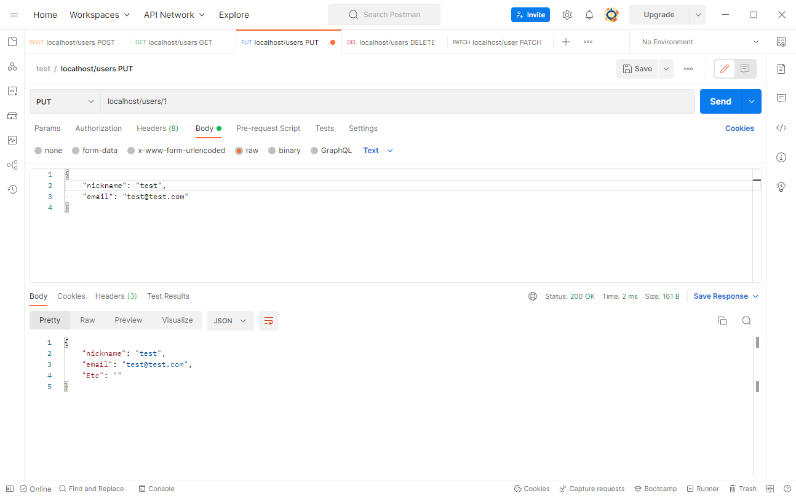{: width="90%" height="90%"}{: .align-center}

{: width="90%" height="90%"}{: .align-center}
- 필수 필드에 대해서만 교체를 요청한 경우인데 Etc 값이 비워진 것이 확인된다.

### 📝 PATCH 요청 테스트 (PATCH /users/:idx)
PUT 요청과 동일한 형태로 PATCH 요청으로 자원을 교체하고 어떻게 교체되는지 확인해보겠다.

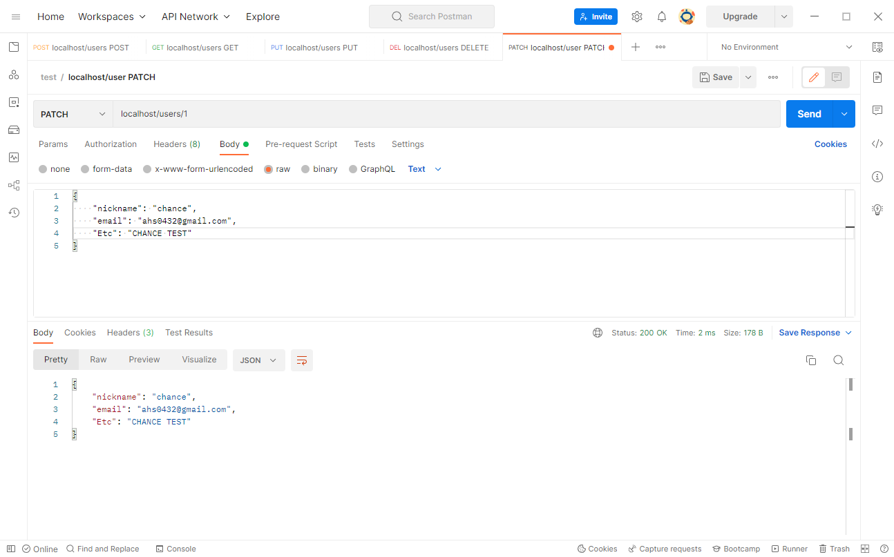{: width="90%" height="90%"}{: .align-center}

{: width="90%" height="90%"}{: .align-center}
- 1번 ID를 가진 자원을 필드 내용을 교체한 뒤 조회해보았다.
- 여기까진 모든 필드를 변경하기에 PUT과 동일한 결과를 보인다.

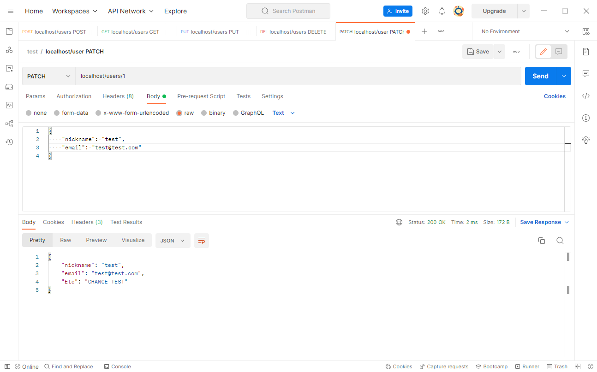{: width="90%" height="90%"}{: .align-center}

{: width="90%" height="90%"}{: .align-center}
- 필수 필드에 대해서만 교체를 요청했을 때 요청한 값만 변경됐다.
- PUT과는 다르게 요청한 필드에 대해서만 값이 수정된 것이 확인된다.

### ❌ DELETE 요청 테스트 (DELETE /users/:idx)
DELETE 요청으로 대상 자원을 지정하고 삭제해보도록 하겠다.

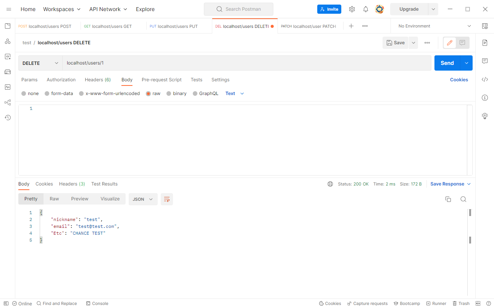{: width="90%" height="90%"}{: .align-center}

{: width="90%" height="90%"}{: .align-center}
- 1번 ID를 가진 자원을 삭제한 뒤 조회해봤을 때 자원이 없기에 404 오류가 발생된다.

---

오늘은 GoLang을 이용하여 REST API를 기본적인 구조로 구현해보았다.

블로그를 열심히 포스팅하고 싶고 소재도 있는데 글이 잘 작성되지 않기도 하고,  
회사 업무 등에 치여서 내 생각보다도 블로그 포스팅하는데에 난항을 겪고 있다...

운영보다 개발 쪽에 관심도 더 많고 근무하고 싶은데 마음대로 안되는게 현실이다..  
그래도 앞으로 더 많은 지식을 공유할 수 있도록 열심히 포스팅해보도록 하겠다!!

정말 긴 포스팅 끝까지읽어주셔서 감사드리며 틀린 내용이 있다면 댓글 부탁드립니다. 😎