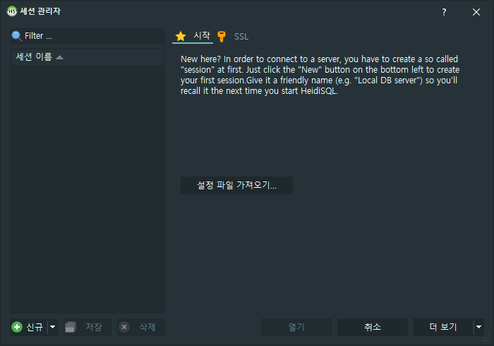
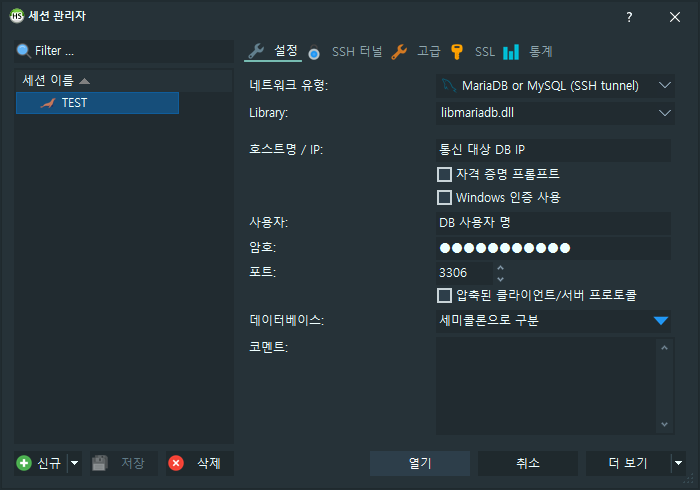
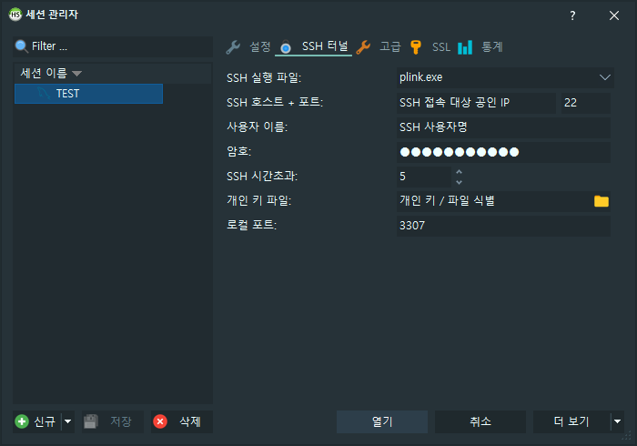
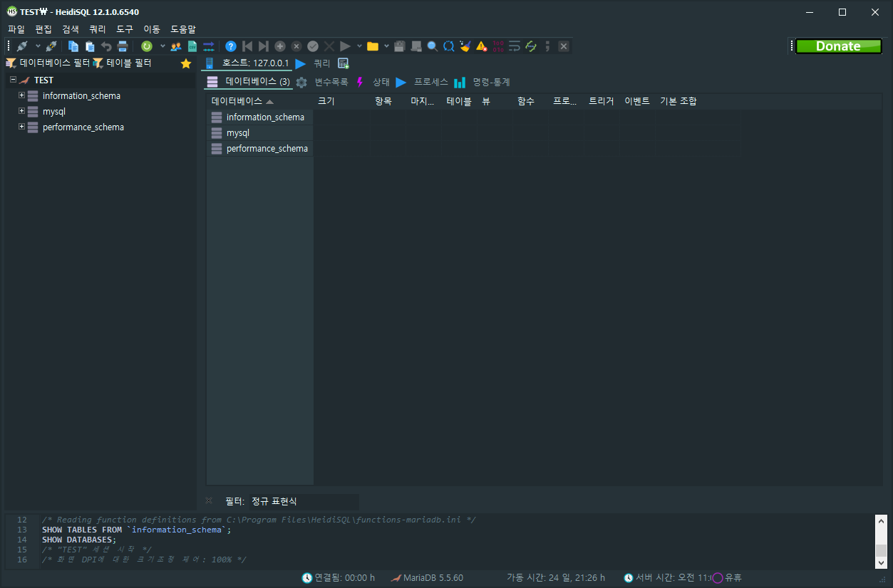

## 🎇 테스트 환경
- HeidiSQL v12.1.0.6540
- MariaDB 5.5.60

## 🔍 사용 방안
- 데이터베이스 서버의 SSH 접근만 가능한 상태일 때 사용이 가능하다.
- 폐쇄망 구현으로 외부에서 데이터베이스에 직접 접속할 수 없는 환경에서 사용된다.  
  이때 외부 SSH 접근이 가능하고 데이터베이스 통신이 가능한 서버가 필수로 필요하다.

## 🔧 진행 방법
{: width="90%" height="90%"}{: .align-center}
- HeidiSQL을 열고 세션 관리자 좌측 하단에 위치한 **신규**를 클릭하여 세션을 만든다.

{: width="90%" height="90%"}{: .align-center}
- 생성한 세션에 **설정** 메뉴에서 아래와 같이 설정을 적용한다.
  - 네트워크 유형 : MariaDB or MySQL (SSH tunnel)
  - 호스트명 / IP : 통신 대상 DB의 IP (SSH tunnel을 사용하므로 사설 or 로컬 IP 입력)
    - 공인 IP : 외부와의 통신 간에 사용되는 공인망 IP (경우에 따라 여기서도 사용 가능)
    - 사설 IP : 공유기, 라우터에서 발행되는 사설망(내부망) IP
    - 로컬 IP : 나 자신을 가르키는 IP (localhost, 127.0.0.1)
  - 사용자 : 데이터베이스 사용자 명
  - 암호 : 데이터베이스 사용자 암호
  - 포트 : 데이터베이스 사용 포트

{: width="90%" height="90%"}{: .align-center}
- **SSH 터널** 메뉴로 이동하여 아래와 같이 설정을 적용한다.
  - SSH 실행 파일 : plink.exe
  - SSH 호스트 + 포트 : SSH 접속 대상 공인 IP / SSH 사용 포트
  - 사용자 이름 : SSH 사용자 명
  - 암호 : SSH 사용자 암호
  - SSH 시간 초과 : 5 (SSH 접속 속도에 따라 적정 값 설정)
  - 개인 키 파일 : SSH 인증 간 Key 인증 시 대상 Key로 지정
  - 로컬 포트 : 현재 사용하고 있는 PC에서 HeidiSQL이 점유할 포트
    - 많은 포스팅을 보았을 때 로컬 포트에 대한 오해가 있는 것 같다.  
      접속 대상에서 사용되는 DB 포트랑 중복되는 건 문제되지 않는다.  
    - 로컬 포트는 접속하는 PC에 접속을 위해 Listen 되는 포트로 확인된다.  
      그렇기에 접속 대상 서버가 아니라 내 로컬 포트 상태를 확인해야 한다.  
    - 아무래도 로컬에 3306을 띄워두고 오류가 발생되는 경우가 많기 때문인지,  
      전체적인 포스팅에서는 MySQL 포트와 겹치지 않게 하도록 권장한거 같다.

{: width="90%" height="90%"}{: .align-center}
- 이전 설정을 모두 완료한 뒤 연결 진행 시 정상 연결될 경우 사진과 같이 확인된다.
- 만약 문제가 발생될 시 방화벽, SSH, DB, DB User/Host 설정에 문제가 없는지 확인한다.

---

오늘은 HeidiSQL을 이용한 SSH Tunnel 접속 방법에 대해 포스팅해보았다.  

HeidiSQL을 이용하는 고객사에서 SSH Tunnel로 접속 방법을 궁금해하여 확인 간  
다른 블로그 포스팅에 내가 알고 있는 것과 다른 내용이 기재돼있어 작성하게됐다.

끝까지 포스팅을 읽어주셔서 감사하며, 틀린 내용이 있다면 댓글 부탁드립니다. 😎