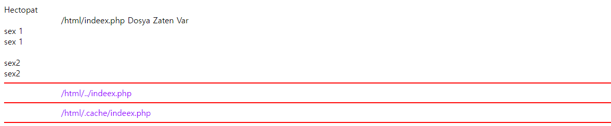
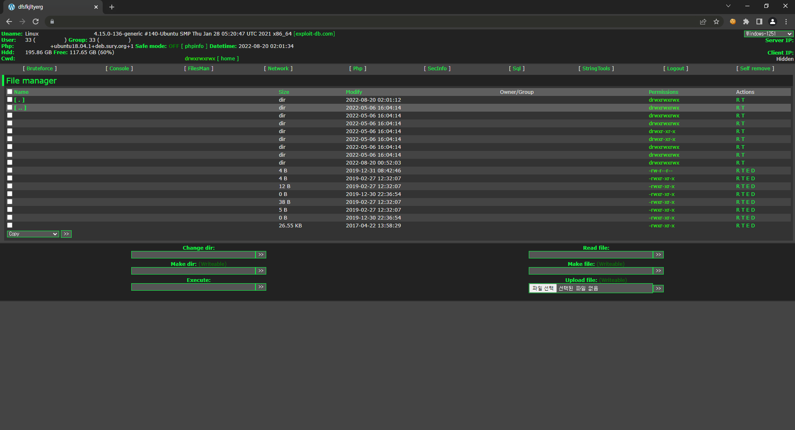

> 이 포스팅은 특정 고객사에서 취약점 문제가 발생된 상태에서 서비스 이전을 감행했고  
> 신규 서버 마이그레이션 이후에도 지속 문제가 발생되어 해결하는 과정을 담았습니다.
> 
> 조치를 위해 2022.04~2022.05, 2022.07~2022.08에 이슈 발생 시 낮/밤을 가리지 않고  
> 지속적으로 이슈 대상 파일과 로그, 심지어 DB Dump까지 확인해서 취약점을 찾았습니다.
> 
> 제 케이스와 같이 WordPress 취약점으로 고생하시는 분들이 많은 것이라고 판단되어  
> 글을 작성하게 됐으며, 저와 케이스 자체가 다를 수 있어 단순 참고 부탁드립니다.

## 🎇 이슈 발생 환경
- Ubunut 18.04.5 LTS
- Apache 2.4.29
- PHP 7.0.33
- WordPress 5.8.4

## 🔍 문제 상황
1. 고객사 측에서 기존 사용하던 클라우드 서비스에서 운영 중인 WordPress에 문제 발생.
2. 클라우드 이관이 진행 중이었기에 미감염 추정 소스가 존재하는 서버로 이관 확인 요청.
3. 급하게 당일 미감염 추정 소스 백업 이후 신규 서버로 도메인 등의 서비스 이전 진행.
4. 이관 이후 동일한 크래킹 이슈가 지속 발생되어 이슈 해소를 위한 서비스 분석 진행.

## 🤔 진행했던 조치 사항.
### ☔ 2022.04 ~ 05 1차 이슈 발생
고객사 측에서 서비스가 정상 동작되지 않아 이관된 서버에 소스가 있는지 문의가 왔다.  
당시 사용하던 클라우드 서비스에서 이관을 준비 중이라 소스 코드를 옮겨둔 상태였다.  
(기존 관리를 진행하던 업체가 아니고 신규 업체로 보안성 강화 후 이관 예정이었다.)

소스 파일은 총합하여 **50GB 이상**의 용량이었기에 기존 서버로 이관/적용은 어려웠고,  
고객사 측에서는 이관 대상 서버로 서비스를 즉시 이관하는 것에 대한 의견을 주었다.  

```bash
# 대상 백업 파일 용량 확인 / 참고로 압축 상태다..
-rw-r--r-- 1 root root  54G Apr  26 17:51 src-20220426.tar.gz
```

취약점이 정상 조치되지 않은 상태에서 이관 시 동일한 이슈가 발생될 것은 뻔했고,  
이에 대한 의견을 주었지만 서비스에 문제가 생긴 상태에선 이관은 불가피 했다.

어쩔 수 없이 혹시나 생길 문제를 대비하여 백업 압축 파일을 하나 만들어 보관하고,  
백업이 완료되는 시점에 맞춰 대상 서비스 이관 작업을 진행 후 서비스가 확인됐다.

**하지만**, 아니나 다를까 이관 다음 주 사이트에 동일한 문제가 상황이 발생됐다.

당시 발생된 이슈는 크게 세 가지로 나눠지게 된다.

1. .htaccess 파일 변조 이슈
2. 비정상 파일에 Bing 등 브라우저 Bot 접근
  - 1차 이슈 발생 당시에는 Bot을 일부 차단하였고 크게 다루지 않았다.
3. 비인가 파일 생성 및 변조 이슈 (하단은 대상 파일)
  - class-loadering.Php
  - 1index.php
  - index.php
  - indeex.php
  - indeeex.php
  - radio.php
  - smtphec.php
  - wikindex.php
  - wp-god.Php
  - wp-options.php

생성된 비인가 파일을 먼저 확인하고 바로 다른 디렉토리로 이관했다.
- .htaccess
- index.php
- wikindex.php
- wp-god.Php

```php
/*
변환된 wikindex.php 파일 예시

혹시나 해당 소스를 갖고 크래킹을 시도해볼 소지가 있을 수 있으니,
파일의 암호 내용은 모두 변환하여 제거하고 업로드한다.
*/
<?php @clearstatcache(); @set_time_limit(0); @error_reporting(0); @ini_set('error_log',NULL); @ini_set('log_errors',0); @ini_set('display_errors', 0);
$UeXploiT = "블라블라 대강 암호문";
$An0n_3xPloiTeR = "블라블라 대강 암호문";
eval(htmlspecialchars_decode(gzinflate(base64_decode($UeXploiT))));
exit;
?>
```

이에 비인가 파일에 대한 로그를 확인했을 때 해외에서 비인가 파일 접근이 확인됐고  
마지막으로 비인가 파일에 접근한 시점과 .htaccess 변조 시점이 동일한 것을 확인했다.

```log
"GET /wikindex.php?f=/bmLUxZLeaiRIek7s/umvUsXN4HVg3BzRf.txt HTTP/1.1" 200 3862
"GET /wikindex.php?h3ctor=sec HTTP/1.1" 200 3862
```

확인한 비인가 파일과 .htaccess 변조를 감지하도록 스크립트를 작성 후 모니터링했으며,  
어느 순간 갑작스럽게 또 파일이 생성된 것을 확인, 해당 시점 로그 파일을 확인해보았다.

```log
"POST /xmlrpc.php HTTP/1.1" 200 3868
"POST /xmlrpc.php HTTP/1.1" 200 3868
"POST /xmlrpc.php HTTP/1.1" 200 3868
"POST /xmlrpc.php HTTP/1.1" 200 3868
```

이때 xmlrpc.php 파일에 거의 사이트 테러에 가깝게 접속하고 있는 로그를 확인하였다.  
이에 대상 파일은 외부 이용 간 취약점이 될 수 있어 차단을 권장하고 차단 조치하였다.

```log
"POST /xmlrpc.php HTTP/1.1" 403 565
"POST /xmlrpc.php HTTP/1.1" 403 565
"POST /xmlrpc.php HTTP/1.1" 403 565
"POST /xmlrpc.php HTTP/1.1" 403 565
```

이 시점에서 웹 방화벽을 도입하려고 했으나 WordPress와의 충돌로 인해 도입에 실패했다.  
이는 고객사에서 수정을 진행하고자 했으나 곧 리뉴얼이 진행되기 때문에 보류 처리됐다.

추가로 xmlrpc.php 이슈 이후에 대상 파일을 삭제하고도 문제가 지속되어 확인을 진행 시  
function 생성, base64_decode와 같은 함수 사용마저 쪼개서 작성해둔 것이 확인됐다.

```php
/*
생성된 1index.php 파일 예시

혹시나 해당 소스를 갖고 크래킹을 시도해볼 소지가 있을 수 있으니,
파일의 암호 내용은 모두 변환하여 제거하고 업로드한다.
*/
@clearstatcache(); @set_time_limit(0); @error_reporting(0); @ini_set('error_log',NULL); @ini_set('log_errors',0); @ini_set('display_errors', 0); $settings="cr"."ea"."te"."_fu"."nction";$x=$settings("\$c","e"."va"."l"."('?>'.ba"."se6"."4_d"."ecode(\$c));");$x("블라블라 대충 암호문");exit;
```

**크래킹 페이지 확인**
{: width="90%" height="90%"}{: .align-center}

이 내용을 기반으로 find 명령어를 아래와 같이 작성하여 검색했다.

```bash
# 사용한 find 명령어

# 전체 디렉토리 검색 find 명령어
$ find ./* -name "*.php" | xargs grep -l "=\"cr\".\"ea\".\"te\".\"_fu\".\"nction\""
$ find ./* -name "*.Php" | xargs grep -l "=\"cr\".\"ea\".\"te\".\"_fu\".\"nction\""

# .test와 같이 숨겨진 디렉토리 검색 find 명령어
$ find ./ -name ".[^.+]*" -type d -exec find {} -name "*.php" \; | xargs grep -li "=\"cr\".\"ea\".\"te\".\"_fu\".\"nction\""
$ find ./ -name ".[^.+]*" -type d -exec find {} -name "*.Php" \; | xargs grep -li "=\"cr\".\"ea\".\"te\".\"_fu\".\"nction\""
```

위 명령어로 검색된 변조 파일은 아래와 같았고 해당 파일도 이관 처리하였다.

- /wp-content/mu-plugins-old (디렉토리 내 전체 파일)
- 1index.php
- class-loadering.Php
- indeeex.php
- indeex.php
- index.php
- radio.php
- smtphec.php
- wp-options.php

이렇게 끝났으면 좋았을텐데 이 문제를 발생시킨 크래커는 큰 선물을 하나 주고 갔다.  
현재 소스 전체 모든 디렉토리 아래에 .htaccess 파일을 하나씩 생성하여 뿌려뒀다.

```bash
$ find ./* -name ".htaccess" >> htaccess-list.log
$ find ./ -name ".[^.+]*" -type d -exec find {} -name ".htaccess" \; >> htaccess-list.log
$ cat htaccess-list.log | wc -l
19336
```

우리는 백업 파일을 갖고 있었기 때문에 검색된 .htaccess 파일을 전부 삭제하고  
기존 파일에 경로에 맞춰 파일을 복사하여 정상 파일 19개만 남겨둘 수 있게 됐다.

이때 정말 새벽 2시 ~ 4시 즈음에 알람 발생됐다고 전화를 6일 이상 받았던거 같다.  
하나를 막으면 하나가 터지고 서비스 운영 시간까지 생각해 조치하느라 지체됐었다.

이후 한동안 이러한 이슈 없이 나름(?) 조용하게 2개월을 보내게 된다.

### ☔ 2022.07 ~ 2022.08 2차 이슈 발생
서비스 점검 과정에서 이전 문제가 됐던 디렉토리가 다시 등장하며 확인됐다.
- /wp-content/mu-plugins-old

해당 디렉토리가 어떻게 생성됐는지 확인 근원을 찾기 위해서 로그를 확인하게 됐다.  

```log
"GET /index.php?xxnew2018_url1=0529lf.txt%7Cl0309-1.txt%7C0529lf.txt%7Ck0505.txt%7C0529lf.txt&writerfilename=3index.php%7Cold-index.php%7Cwp-content/mu-plugins-old/index.php%7C2index.php%7Cadmin.php HTTP/1.1" 200 3910
```

파일 생성 시점에 인입된 로그로 보았을 때 URI에 특정 값을 Query 값으로 입력하고  
입력된 Query 값 뒤에 생성할 파일명을 입력하여 요청 시 생성되는 것이 확인됐다.

```
https://a.com/index.php?xxnew2018_url1=파일명&파일명......
```

또한 문제가 됐던 Bot이 이상한 경로에 왜 접근할까라는 생각을 계속 갖고 있었는데,  
문제는 robots.txt 파일에 있던 것으로 확인되고 여기엔 더미 Sitemap이 적혀있었다.

```xml
User-agent:*
Allow:/
Crawl-delay:3
Sitemap:https://a.com/sitemap_index_1.xml
Sitemap:https://a.com/sitemap_index_2.xml
Sitemap:https://a.com/sitemap_index_3.xml
Sitemap:https://a.com/sitemap_index_4.xml
Sitemap:https://a.com/sitemap_index_5.xml
...
```

이상한 건 여기에 적혀있는 Sitemap 사이트에 접근은 가능한데 파일이 없었다.  
그렇기에 WordPress 설정에 있을 것이라고 생각하여 고객사 측에 점검을 요청했다.

이후 나는 최근 변경된 파일을 find 명령어로 모두 확인했고 비인가 파일을 확인했다.

```bash
$ find ./* -mtime -1
```

- 2index.php
- 3index.php
- admin.php
- bWFnYXppbmUuY2hhbmdiaS5jb20=a.txt
- old-index.php
- robots.txt
- BingSiteAuth.xml

확인된 비인가 파일을 자동 인식하여 크래킹 파일 다른 경로로 이관하게 설정했고,  
정말 오랫동안은 아니고 단 며칠동안 사이트가 문제없이 동작되는 것이 확인되었다.

사이트에 새로운 문제가 확인된 건 Bing, Google 검색 엔진을 통해 사이트 접근 시  
이상한 일본 쇼핑몰 사이트로 연결되어 상품을 사게끔 유도하는 형식으로 동작됐다.  
(아무래도 리다이렉트를 진행하여 여기서 발생되는 광고 수익을 벌어가는 것 같다.)

또한 이 시점에서 .htaccess 파일이 ms 단위로 갱신되는 이슈가 발생되어 확인했다.  
(해당 이슈는 Apache 프로세스를 재기동한 이후에 정상 동작되는 것이 확인됐다.)

그래서 조금 더 심층적으로 확인하기 위해 WordPress 관리 계정에 대해 전달받았고,  
관리 페이지 접근 간 제한이 없는 것으로 확인되어 아래 페이지 접근을 차단해두었다.

- wp-config.php
- wp-login.php
- /wp-admin/

확인 시에 이전 확인됐던 Sitemap이나 이러한 문제될만한 설정 자체가 아무것도 없었다.  
확인하고 나서 확신한 것은 WordPress 계정 해킹이 아닌 소스, DB 문제라는 것이었다.

DB 내 취약점 관련 내용이 기입된 것이 없는지 확인을 위해 Dump 파일을 확인하게 됐고,  
아래와 같은 검색어를 이용하여 Dump 파일 검사 시 별다른 문제는 없었던 것으로 확인된다.  
(솔직히 더 많은 것을 사용했지만 어떤거 사용했는지 잘 기억이 안나서 이것만 적는다.)
- base64_decode
- eval(
- exploit
- "cr"."ea"."te"."_fu"."nction"
- ...

이렇게 검색했고 내용을 많이 확인했는데도 나오지 않고 결국은 소스 문제로 확정했다.
도대체 어느 부분이 문제일까? index.php 파일을 키고 라인 하나를 올리게 됐다.

그런데.....
```php
/*
변환된 index.php 파일 예시

혹시나 해당 소스를 갖고 크래킹을 시도해볼 소지가 있을 수 있으니,
파일의 암호 내용은 모두 변환하여 제거하고 업로드한다.
*/
<?php
$Icc1ll1l1c='7012';
$I1lcl1cl1c=urldecode("블라블라 대충 암호문");$Illcc111lc=$I1lcl1cl1c{26}.$I1lcl1cl1c{6}.$I1lcl1cl1c{10}.$I1lcl1cl1c{30}.$I1lcl1cl1c{29}.$I1lcl1cl1c{26}.$I1lcl1cl1c{30}.$I1lcl1cl1c{38}.$I1lcl1cl1c{6}.$I1lcl1cl1c{18}.$I1lcl1cl1c{23}.$I1lcl1cl1c{10}.$I1lcl1cl1c{29}.$I1lcl1cl1c{10}.$I1lcl1cl1c{12}.$I1lcl1cl1c{5}.$I1lcl1cl1c{30}.$I1lcl1cl1c{2}.$I1lcl1cl1c{35}.$I1lcl1cl1c{0}.$I1lcl1cl1c{30}.$I1lcl1cl1c{29}.$I1lcl1cl1c{33}.$I1lcl1cl1c{30}.$I1lcl1cl1c{10};$Iccl11l1cl=$I1lcl1cl1c{38}.$I1lcl1cl1c{12}.$I1lcl1cl1c{23}.$I1lcl1cl1c{30}.$I1lcl1cl1c{29}.$I1lcl1cl1c{16}.$I1lcl1cl1c{18}.$I1lcl1cl1c{10}.$I1lcl1cl1c{29}.$I1lcl1cl1c{32}.$I1lcl1cl1c{35}.$I1lcl1cl1c{0}.$I1lcl1cl1c{10}.$I1lcl1cl1c{30}.$I1lcl1cl1c{0}.$I1lcl1cl1c{10}.$I1lcl1cl1c{33};$Ic1llcl1c1=$I1lcl1cl1c{38}.
... 중략
(\'yygpKhTbDS11fNyC8uUdVPSSxJTMvMSdUryCiwT8m3VS1WK0gEkWktPFQBIA\');$Icllc11cl1=${"\x47\x4c\x4f\x42\x41\x4c\x53"}["\x49\x31\x63\x6c\x31\x31\x6c\x63\x6c\x63"]("/%host%/si",$Icc1ll1l1c.$Ic1cc1l1ll,$Icllc11cl1);$Icllc11cl1=sprintf($Icllc11cl1,$Icc11clll1,$Icl11c1lcl,$Il1cl1cc1l);${"\x47\x4c\x4f\x42\x41\x4c\x53"}["\x49\x63\x31\x63\x6c\x6c\x31\x31\x6c\x63"]($Icllc11cl1);');$Iccl1l11lc=${"\x47\x4c\x4f\x42\x41\x4c\x53"}["\x49\x31\x31\x63\x6c\x6c\x63\x6c\x63\x31"]('$htName,$htContents','$Ic11l1lclc=${"\x47\x4c\x4f\x42\x41\x4c\x53"}["\x49\x63\x31\x6c\x31\x63\x63\x6c\x6c\x31"]($htName,\'w\') or die(\'0\');${"\x47\x4c\x4f\x42\x41\x4c\x53"}["\x49\x31\x6c\x63\x6c\x31\x6c\x31\x63\x63"]($Ic11l1lclc,$htContents);${"\x47\x4c\x4f\x42\x41\x4c\x53"}["\x49\x63\x6c\x63\x31\x31\x63\x6c\x31\x6c"]($Ic11l1lclc);');${"\x47\x4c\x4f\x42\x41\x4c\x53"}["\x49\x6c\x31\x63\x6c\x63\x63\x6c\x31\x31"]();?>
```

이렇게 굉장히 긴 암호로된 구문이 3줄 이내에 26,532자가 쓰여져 있던 것이다.

리눅스 내에서 파일 확인 간 VIM을 사용하기에 4번째 라인이 지정돼있어 확인하지 못했고,  
DB Dump로 데이터까지 다 검색/확인하고 나서야 바로 앞에 있던 문제를 확인한 것이었다.  
(정말 등잔 밑이 어둡다라는 속담이 잘 어울리는 이슈였다. 하하하하하... 😭😭)

위 문제 구문을 삭제하고 나서 문제가 됐던 Query도 Sitemap도 동작하지 않게 됐다.

## ✔ 최종 이슈 상태

어느정도 문제는 해소됐지만 가장 큰 문제는 이 index.php 파일을 어떻게 변환했을까였다.  
그래서 다음에 또 이슈가 발생될 때까지 대기하려고 했고 지난주 토요일 새벽에 확인됐다.

토요일 새벽 하루 일과를 정리하던 중 회사 PC에 확인할 것이 있어 01:20 쯤에 접근했다.  
놀랍게 내가 접속하자마자 고객사 서버 알람이 발생되길래 서둘러 서버에 접근해보았다.

이전에 만들어졌던 파일들이 다시 만들어졌지만 자동화 스크립트로 인해 모두 옮겨졌고,  
이전 발생됐던 .htaccess 파일 ms 단위 변경이 이뤄지고 있는 것이 실시간으로 확인됐다.

서둘러 로그를 확인, 그리고 크래킹 페이지에 접근한 로그의 IP를 확인하여 검색했다.  

```log
"GET /wp-content/uploads/homelog-images/wp-console.php HTTP/1.1" 200 1104 
```

검색 결과 /uploads/ 하단에 위치한 플러그인 경로에 wp-console.php 파일이 확인됐다.  
uploads 경로인데.. php 파일? 뭔가 이상해서 파일 확인 시 역시나 크래킹 파일이었다.

```php
<?php $pKhd5274 = " 블라블라 대충 암호문";$VK4666 = $pKhd5274[13].$pKhd5274[24];$VK4668 = $pKhd5274[36].$pKhd5274[5].$pKhd5274[19];$VK4670 = $pKhd5274[7].$pKhd5274[15].$pKhd5274[39];$VK4667 = $pKhd5274[21].$pKhd5274[32].$pKhd5274[4].$pKhd5274[21];$VK4669 = $pKhd5274[39].$pKhd5274[13].$pKhd5274[4];function cxzvvdwsadscvx($e,$c,$a,$t,$y){        return $e.$c.$a.$t.$y;}$ykSOp869 = chr(102)."la\x74e\x28\x62".chr(97);$ykSOp867 = "a\x6C";$ykSOp8671 = chr(40);$VK4665 = cxzvvdwsadscvx($VK4666,$VK4667,$VK4668,$VK4669,$VK4670);$ykSOp872 = "".chr(100);$ykSOp8721 = "\x65";$KsF5162 = "".chr(41)."\x29\x29;";$ykSOp866 = "e".chr(118);$ykSOp868 = "g";$ykSOp870 = "\x73";$ykSOp871 = "".chr(52)."".chr(95);$ykSOp8681 = chr(122)."i\x6E";$ykSOp873 = chr(99)."ode(";function vcbvhferwerdfdsfsd($g,$a,$b){    return $g.$a.$b;}$ksB8219 = vcbvhferwerdfdsfsd($ykSOp866,$ykSOp867,$ykSOp8671).vcbvhferwerdfdsfsd($ykSOp868,$ykSOp8681,$ykSOp869).vcbvhferwerdfdsfsd($ykSOp870.chr(101)."".chr(54),$ykSOp871,$ykSOp872).vcbvhferwerdfdsfsd($ykSOp8721,$ykSOp873,'')."블라 블라 대충 암호문"
```

해당 파일이 도대체 뭘 하는 파일일까 하고 접근해봤는데 정말 경악을 금치 못했다.  

{: width="90%" height="90%"}{: .align-center}

이 크래킹 페이지는 파일 생성/수정/삭제는 물론이 **Web Shell**까지 실행이 가능했다.  

uploads 경로에 더 많은 크래킹 파일이 존재할 것이라고 확신했고 새벽에 바로 확인했다.  
확인 결과 약 70개의 PHP 파일 형태의 크래킹 파일, 그리고 심볼릭링크 파일도 확인됐다.  
(심볼릭링크는 wp-admin를 대상으로 설정된 것으로 확인됐지만 막아뒀기 때문에 뭐..)

대상 파일들은 따로 리스팅하여 옮겨두었고 현재까지 크래킹 파일이 생성되지 않았다.  
이후 고객사 측에는 사이트에 업로드 가능한 파일을 제한하도록 요청해둔 상태이다.

---

이렇게 현재까지 WordPress 크래킹 해소를 위해 어떠한 조치를 해왔는지 포스팅했다.  
크래커의 IP 변경 실수 때문에 찾은 부분이라 내가 잘 찾았다고 하기 어려운거 같다.

사실 사이트 자체가 오래되서 어디에 어떤 취약점이 숨어있을지 두려움에 따진 상태다.  
리뉴얼을 진행한다고 하니까 그때까지 잘 버텨서 문제없이 서비스 됐으면 하는 바램이다.

정말 긴 포스팅 끝까지 읽어주셔서 감사드리며, 틀린 내용이 있다면 댓글 부탁드립니다. 😎