> ⚠️ 해당 포스팅은 애플에 관심이 많은 사람의 주관적 의견으로 작성됐습니다.

## 📈 이벤트 후기
새벽에 진행한 이벤트를 본 그냥 직접적인 후기는 정말 환상적인 U/I를 만들었다는 것이다.

사실 알약 디지인이라고 불리는 디자인을 봤을 때 그 중앙 영역을 어떻게 활용할까 궁금했다.  
이벤트를 시청한 이후 디자인을 보고는 정말 기대 이상이었다고 밖에 설명할 수 없을 것 같다.

이벤트 자체는 재밌었고 각 파트 별로 내가 재밌게 봤던 포인트 같은 걸 작성해보려고 한다.

## ⌚️ Apple Watch

### 8️⃣ Series 8
우선 첫 번째 순서는 Apple Watch였고 예상한대로 초반 시나리오가 흘러갔다.  
지속 언급됐었던 온도 측정 기능을 이용한 여러가지 개선점을 설명하고 있었다.  

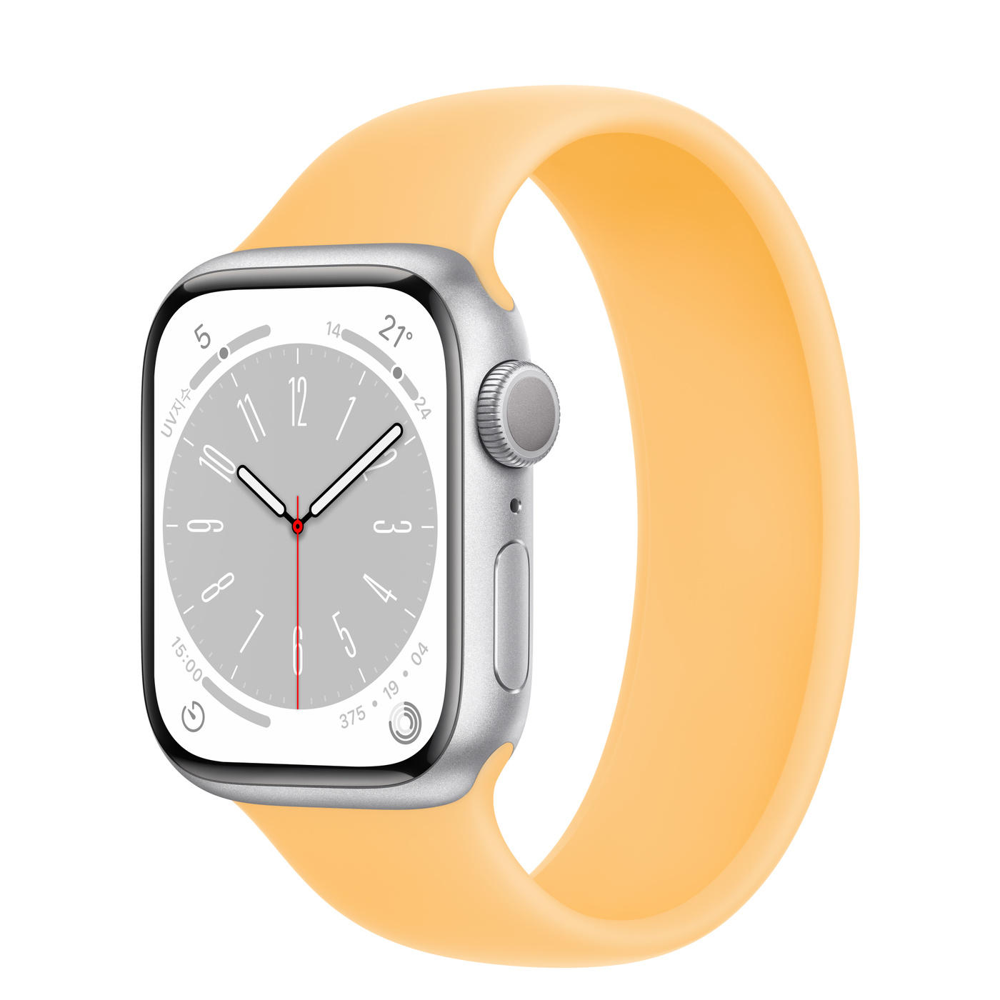{: width="60%" height="60%"}{: .align-center}  

또한 교통사고 등의 문제 발생 시 대응이 가능하도록 충돌 감지 기능이 추가됐다.

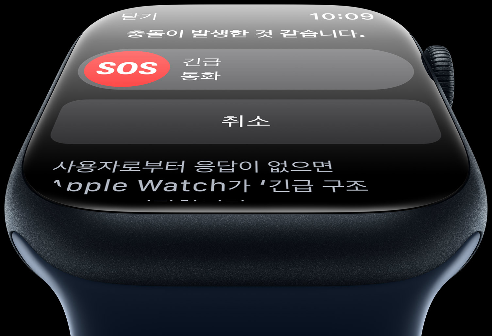{: width="60%" height="60%"}{: .align-center}  

가격을 확인했을 때에는 국내가는 41mm는 59.9만원, 45mm는 63.9만원이다.  
전년 대비 각각 10만원씩 인상을 보이고 있고 셀룰러 모델은 각 15만원씩 추가다.

### 😳 SE
앞선 Series 8 순서 이후 예상하지 못했던 것은 Apple Watch SE의 출시이다.  
SE는 Series 6때 같이 나왔기 때문에 당연하게 리뉴얼에는 시간이 걸릴 줄 알았다.

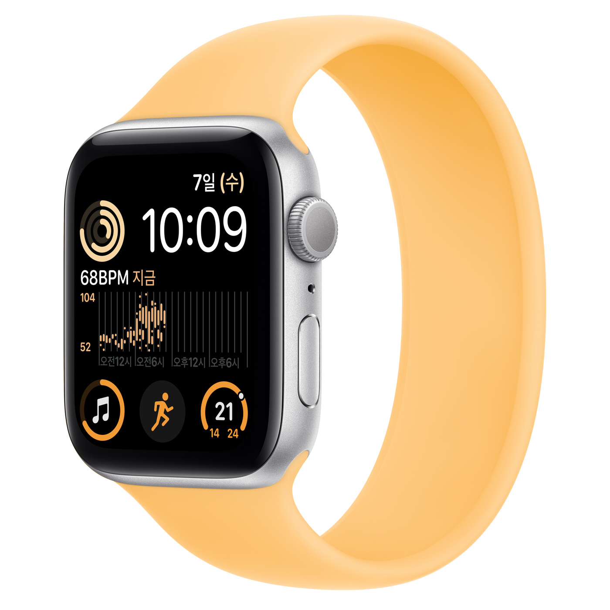{: width="60%" height="60%"}{: .align-center}  

그런데 결국 애플이 일을 저질렀고 충격 방지 및 여러 기능 개선 이후 출시하였더라.  
큰 변환점은 후면 케이스를 재디자인하여 나일론 합성 소재로 변경됐다는 점이다.  

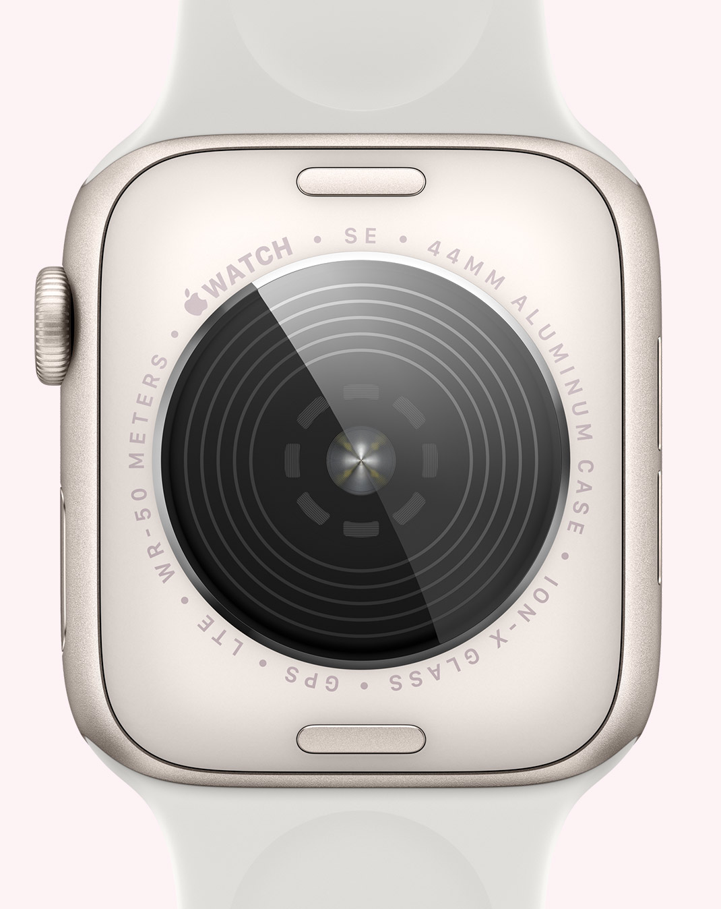{: width="60%" height="60%"}{: .align-center}  

같이 이벤트를 시청하던 형 중 하나가 SE를 그렇게 기다렸는데 소리를 지르더라..

가격을 확인했을 때 전년과 동일하게 40mm 35.9만원, 44mm 39.9만원이다.  
셀룰러 모델은 각 7만원 씩 추가고, 환율 인상에도 동결이라는게 감동스럽다.

### 🥳 Ultra
오늘 Watch 공개 이벤트에서 메인으로 기대하고 있었던 부분이 여기다.

드디어 몇 년 전부터 소문만 엄청 무성했던 러기드형 Watch가 공개됐다.  
솔직하게 말해서 공개되고 디자인을 봤는데 진짜 감동 먹었다. 너무 이쁘다.

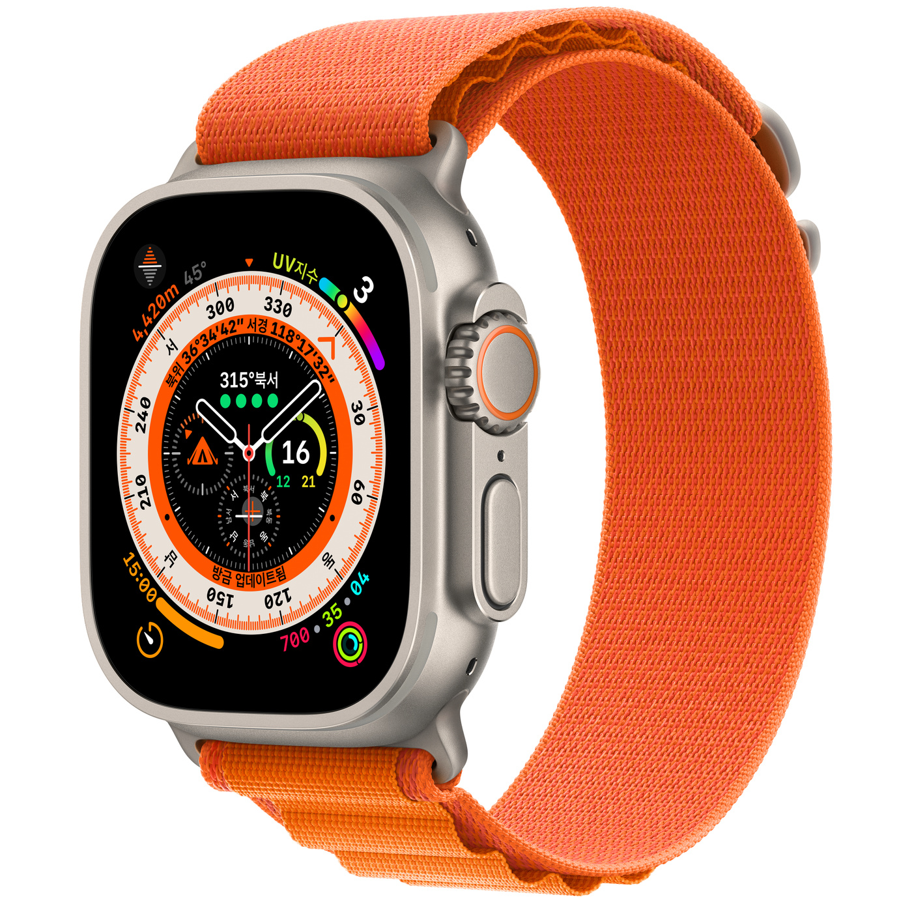{: width="60%" height="60%"}{: .align-center}  

하지만 전문가 용도로 나오다보니 많은 기능이 나의 생활과 거리감이 있었다.  
예를 들어 스쿠버 다이빙에 특화된 기능이라거나 탐험의 특화된 기능이었다.

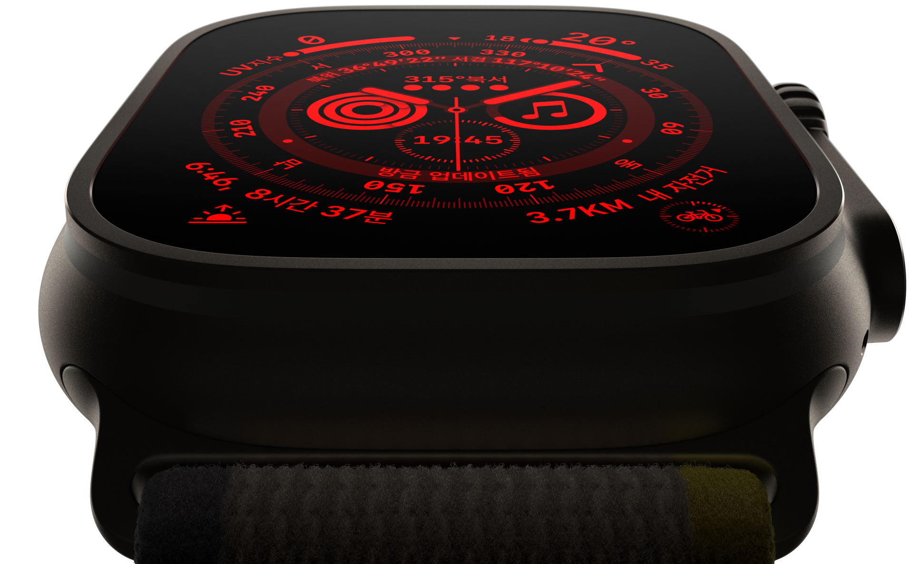{: width="60%" height="60%"}{: .align-center}  

심지어 최대 화면 밝기가 2000nit까지 올라간다고 하니 장난이 없다 하하..

가격은 외국 출고가 $799, 국내가는 114.9만원으로 출고가 확인된다.  

단순 환율로만 계산해보았을 때 약 110만원 정도인데 부가세를 감안했을 때  
약 10%의 금액이 추가된다고 가정했을 때 오히려 싼 가격이라 놀라웠다.

## 🎧 Airpods Pro (Gen 2)
다음은 Airpods Pro 신형 공개였는데 디자인이나 이런 부분이 그대로였다.  

사실 나는 처음 Airpods Pro 출시 때 거의 완성형 디자인이라고 생각했기에  
이후에 어떤 변화가 있을까 싶었는데 역시나 변경은 쉽지 않았던 것으로 보인다.  

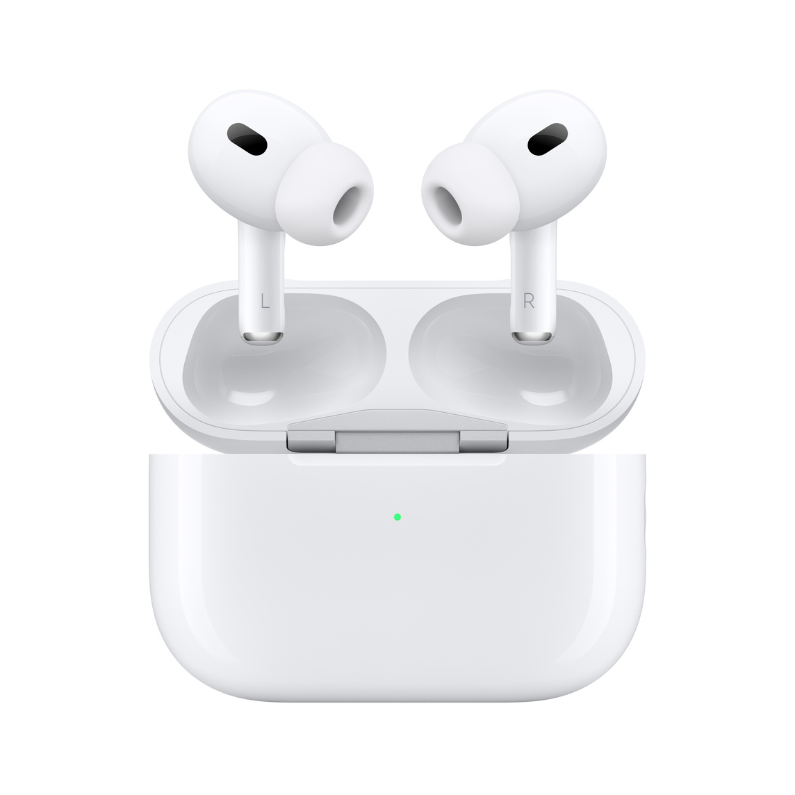{: width="60%" height="60%"}{: .align-center}  

일명 콩나물 디자인에 대한 아이덴티티도 명확하고 통화 품질 상 이 점도 많기에..  

주된 변경점은 노이즈 캔슬링 성능이 2배 올라갔고 탑재된 칩셋이 변경된 것이다.  
이외 음질이나 이런 부분도 전체적으로 개선됐고 케이스 디자인과 기능이 추가됐다.

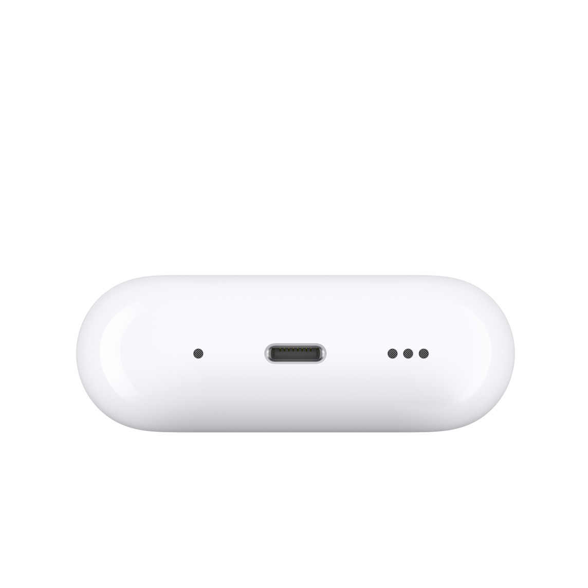{: width="60%" height="60%"}{: .align-center} 

랜야드 루프를 지원하는 형태이고 기기 자체 탑재로 나의 찾기 기능도 이용할 수 있게 됐다.  

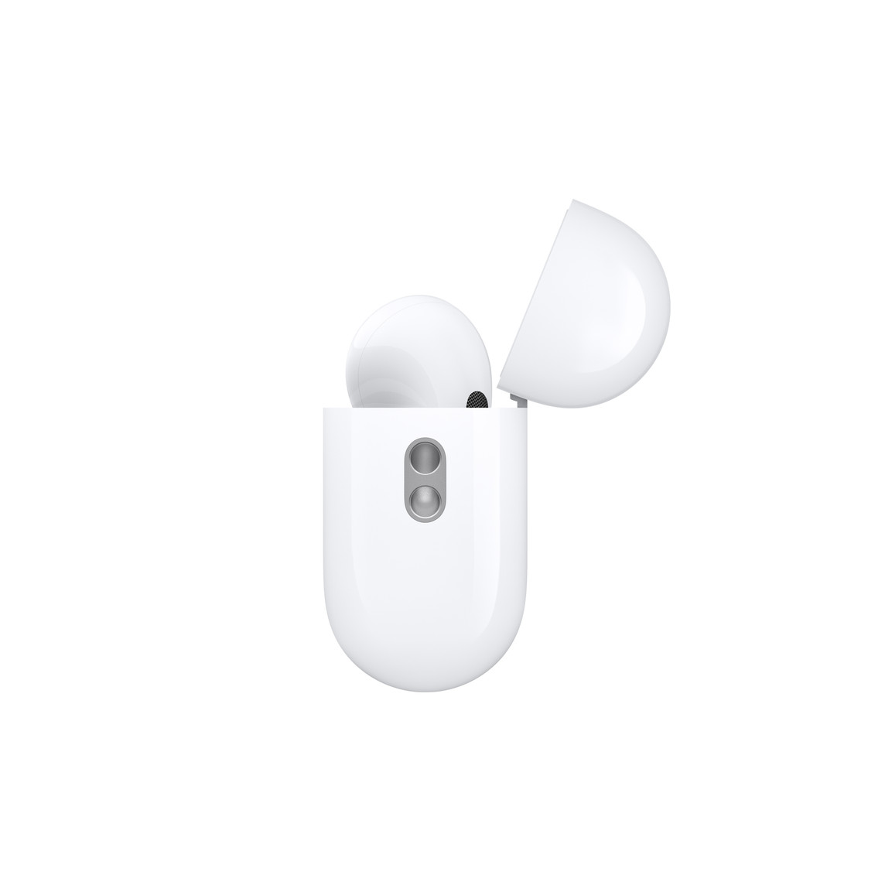{: width="60%" height="60%"}{: .align-center} 

또한 iPhone의 TrueDepth를 이용한 귀 모양 스캔 후 자동으로 커스텀해준다고 한다.

가격은 기존 32.9만원보다 상승된 35.9만원으로 약 3만원 정도의 인상을 보였다.  
근데 환율을 생각하면 40만원 정도의 금액을 예상했던 것보다 많이 싸게 나오긴 했다.

고민되는 건.. 제품의 차이가 크지 않다고 판단되고 있어 기변에 고민이 크다는 것.

## 📱 iPhone
대망의 iPhone인데 기본형은 모르겠는데, 정말 Pro 라인업은... 장난아니다.

### 🆕 Normal
우선 기본형은 기존과 동일한 노치 디자인으로 출시됐고 여러 개선점이 존재한다.

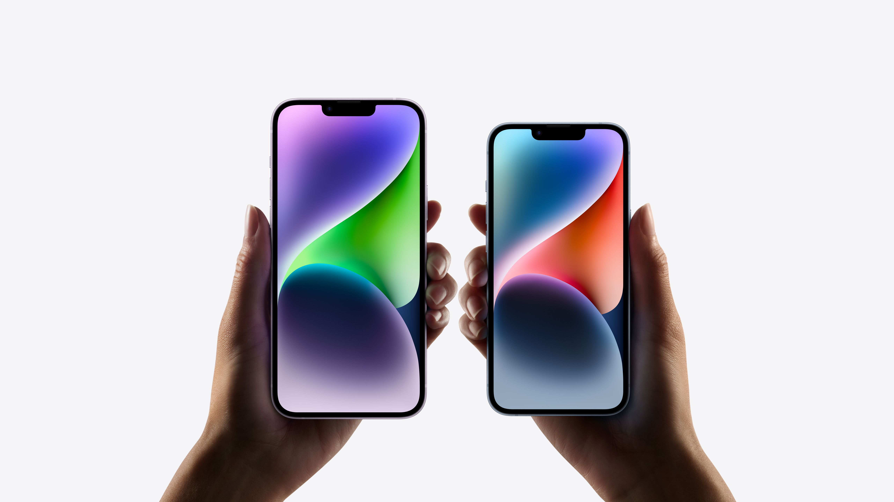{: width="60%" height="60%"}{: .align-center} 

일단 배터리 타임이 어느정도 개선됐고 카메라 성능과 기능에 큰 개선점이 있다.  
Watch와 동일하게 충돌 감지 기능이 추가됐고 안전에 키워드를 맞춰 만들어졌다.

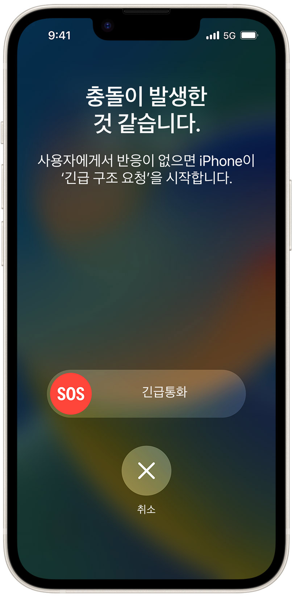{: width="60%" height="60%"}{: .align-center} 

칩셋은 예상한대로 13 Pro과 동일한 A15 Bionic을 사용한 것이 확인된다.  
그리고 미니 모델의 단종과 Plus 모델의 추가로 예전과 동일한 라인업이 됐다.  

가격은 $799 동결로 책정됐고 많은 유저층을 포용하기 위함으로 보인다.   
국내가는 125만원부터로 Watch Ultra랑 달러가는 같은데 책정가가 다르다.

### 💻 Pro
마지막은 모든 시청자의 관심사이자 이번에 디자인 변경을 맞은 Pro 라인업이다.  

{: width="60%" height="60%"}{: .align-center} 

가장 큰 변경점으로는 Dynamic Island라는 노치를 대체하는 공간이라고 본다.  
이전 포스팅에서 올린 사진과 다르게 하나로 뭉특한 알약 디자인을 갖고 있다.  

이부분의 활용 방안이 뭘까 싶었는데.. 이 부분이 OS 영역과 이어 사용되더라.  
GIF로 가져와봤는데, 감상해보면 이런 UI와 아이디어가 되는구나 싶을거다. 

{: width="60%" height="60%"}{: .align-center} 

심지어 여기에 카메라 센서들도 굉장히 좋아져 광원, 망원 카메라 성능 향상,  
그리고 메인 카메라는 4배 향상된 48MP까지 지원되는 렌즈로 바뀌었다.  

항상 애플은 칩셋 설계가 장난아닌데 A16은 배터리, 성능까지 크게 향상됐다.

또한 AOD가 추가되어 화면이 꺼진 상태에서도 위젯, 알람 등의 확인이 가능하다.

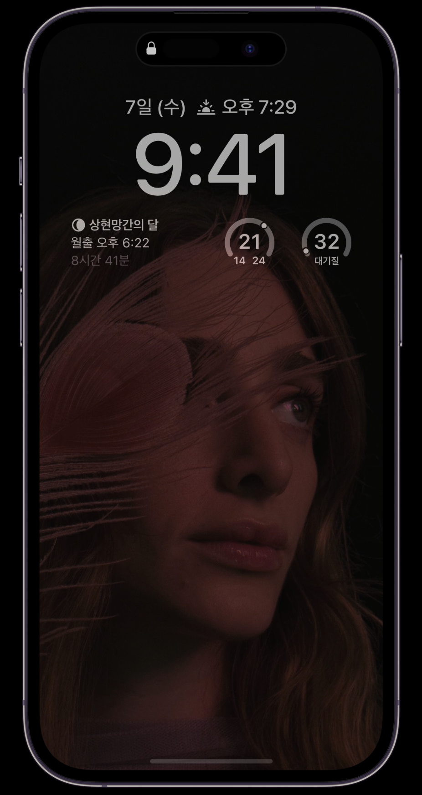{: width="60%" height="60%"}{: .align-center} 

큰 변화점은 이정도인거 같고 가장 궁금한건 사실 이 제품의 가격은 얼마일까이다.  

놀랍게도 또 동결로 $999부터 시작하게 되는데 아쉬운건 역시 환율이라는 문제다.  
국내 출시가는 155만원인데 전작이 134.2만원이었던 것에 비해 많은 가격 상승이다.

환율에 비해서 가격이 많이 상승하진 않았지만 그래도 높은 가격인건 사실이다.

나는 iPhone 13 Pro Max를 사용 중이고 앞으로 3년은 더 쓸 계획이기에  
기변 생각은 없었지만 이번 제품은 역시 변경점이 많아서 그런지 탐나긴 하네..

친구 두 명이 기변 시기가 되서 변경한다고 못 박았고 변경하면 자랑한다고 한다.  
부럽긴 하지만 나는 이후 제품을 구입할려고 하기에 바꿀 때 되면 나도 자랑해야지.

---

솔직히 깊은 내용으로 포스팅을 작성하고 싶지만 그렇지 못한 시간으로 인해..  
이번 이벤트 자체는 정말 재미있었고 제품의 퀄리티와 아이디어에 감동받았다.

OS는 10월 이벤트에 출시되고 그 때 다른 제품들도 공개할 것으로 추측되고  
그때되면 재미있는 새로운 제품이 공개될테니 새로운 기대를 품고 시청해야겠다.

사용된 이미지는 전부 Apple 공홈과 이벤트 사진이니까 출처는 Apple이다.

끝까지 포스팅을 읽어주셔서 감사드립니다. 😎