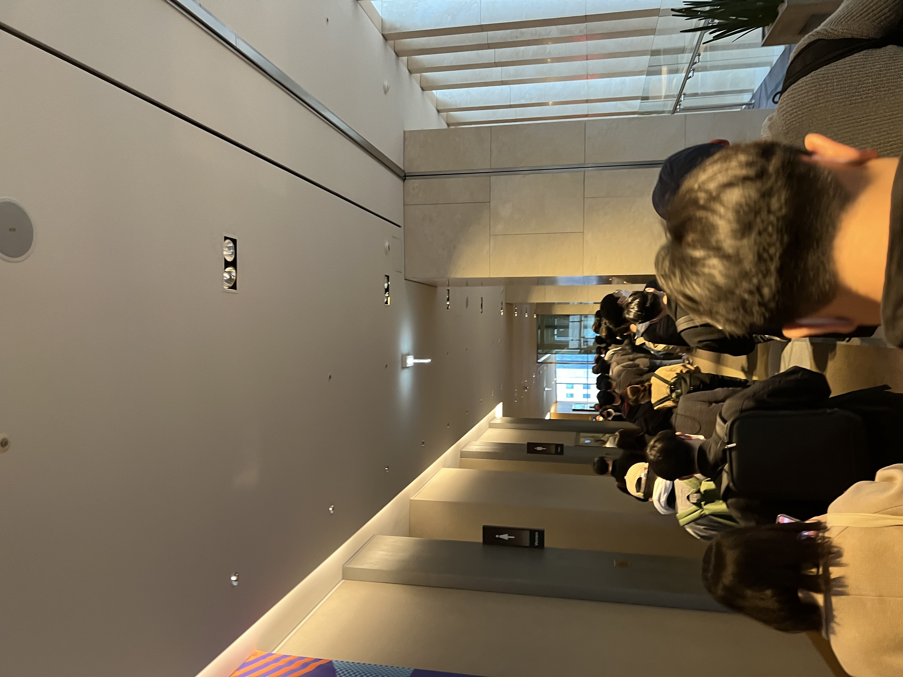
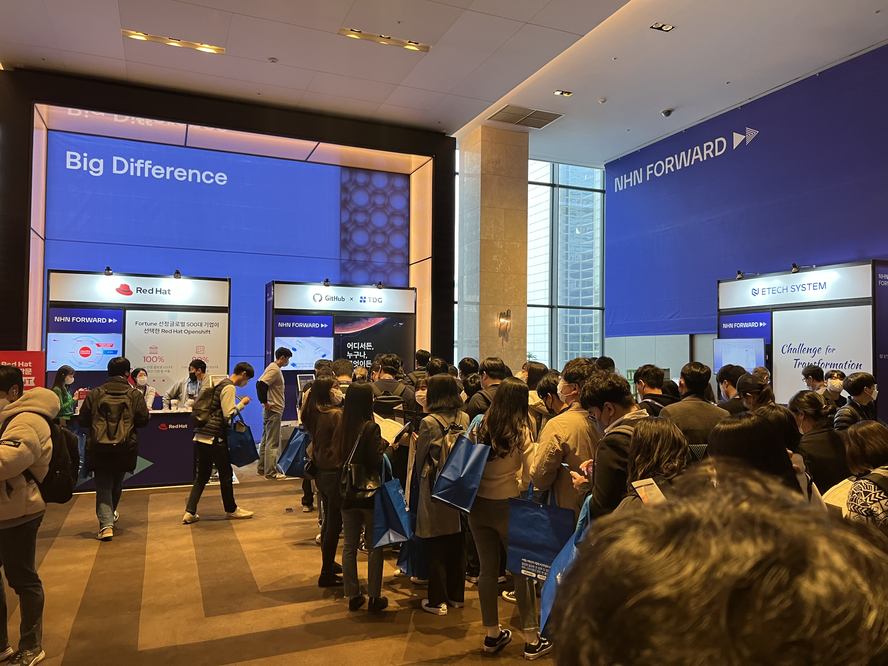
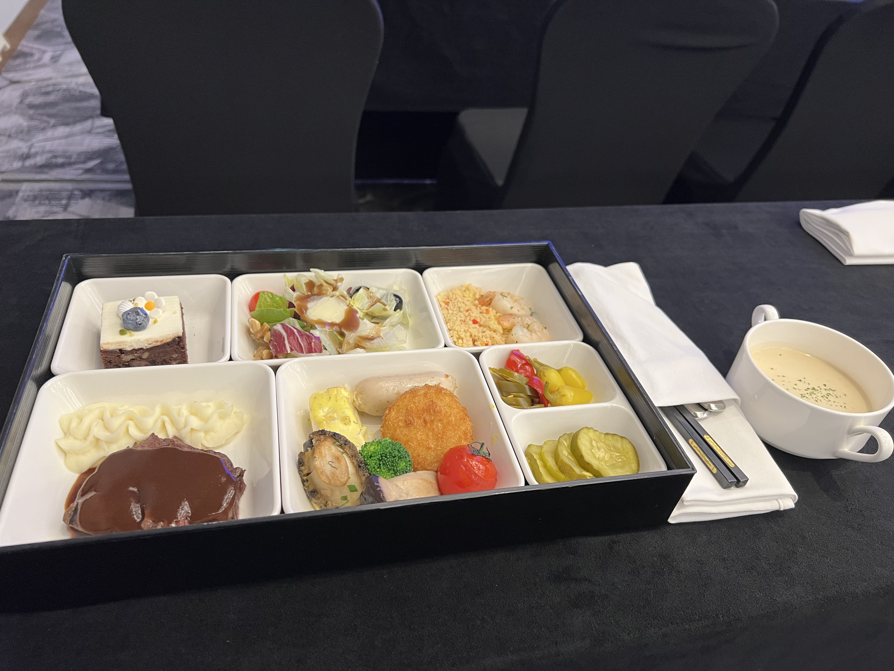
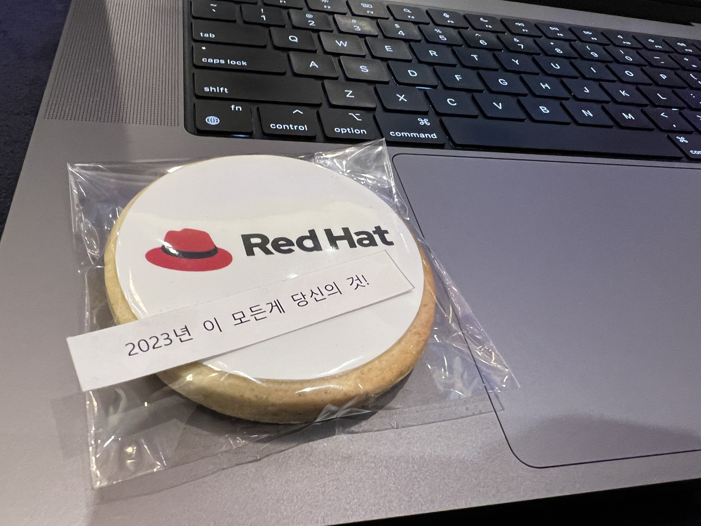

## 🥳 NHN Forward 22
2022년 11월 24일(목) NHN Forward 22 행사가 개최되었다.  
나는 이전에 신청해뒀었는데 참가 확정 메일이 와서 참여하게 됐다.

사실 처음엔 이번 행사가 오프라인으로 개최되는 줄 알고 참여했는데,  
참석할지. 온라인으로 영상이 올라오면 시청할지 고민을 많이했었다.

19년도 이후 처음으로 오프라인 개최한다고 하여 참여를 결정했다.

## 😳 입장
{: width="80%" height="80%"}{: .align-center}  

사진에서 볼 수 있듯이 9시 입장보다 일찍 왔는데 이렇게나 많은 사람이 있었다.  
점심 식사는 1,200명까지 제공한다 했으니 그거보다 많은 인원이 왔을 것 같다.

{: width="80%" height="80%"}{: .align-center}  

참가자 인증 후 들어와봤더니 식권이 포함된 부스 소개 등이 작성된 쿠폰을 받았다.  
그리고 안쪽에 들어가서 NHN에서 준비한 슬리퍼, 스티커가 포함된 기념품을 받았다.

## 🗂 부스 체험
{: width="80%" height="80%"}{: .align-center}  

초반 입장을 끝내고 뒤를 봤더니 엄청난 인파가 하나의 줄에 모여있는게 보였다.  
GitHub 부스 라인이었는데 개발자가 얼마나 GitHub에 열광하는지 알 수 있었다.  

그외에도 각종 부스가 있었는데 사진으로 담기에는 너무 돌아다녀서 다 찍지는 못했다.  
각 부스마다 행사와 기념품을 이용한 홍보가 진행되고 있었고 재미있는 요소도 있었다.

나는 조금씩 시간을 내어서 모든 부스를 다 체험해봤고 기념품도 많이 받아왔다.

## 📝 Keynote
입장하고 나서 잠깐의 부스 체험 이후 행사 소개로 Keynote를 참여할 수 있었다.

여기선 올해 NHN이 어떤 방향성을 갖고 있는지 어떤 사업을 진행하고 있는지에 대해서  
설명하는 시간을 가졌고 NHN이 다양한 분야로 확장하고 있고 투자하고 있음을 알았다.

여기서 가장 강조된 분야는 4가지로 Game, Data Platform, Cloud, AI 사업이었다.  
이렇게 개발된 사업을 사용자에게 제공하고 더 나은 개발 환경을 제공할 예정이라 한다.

## 1️⃣ Session
간단한 Keynote가 끝나고 나서 첫 번째 세션에 참여할 수 있도록 이동 시간이 주어졌다.  
나는 인터넷에서 취약점 때려잡기 - 공개출처정보(OSINT) 활용 기술을 청취하게 됐다.

### 인터넷에서 취약점 때려잡기 - 공개출처정보(OSINT) 활용 기술 - Track 4
이 세션에서는 OSINT 기술이 무엇인지와 우리 주변에 어떤 것이 있는지를 설명했고,  
이를 이용한 취약점을 발견하고 해결하는 방법과 사례에 대해서 설명을 들을 수 있었다.

우선 OSINT는 Open Source INTelligence의 약자로 공개출처정보를 뜻하고 있다.  
이는 공개된 출처에서 합법적으로 수집하는 정보를 뜻하는 것으로 이해하면 쉬울 것이다.

대표적으로 구글 검색을 이용한 해킹이 있고 이외에도 굉장히 다양한 요소들이 있었다.  
OSINT에 대한 내용은 나중에 내가 조금 더 내용을 정리하여 포스팅할까 생각 중이다.

## 점심 식사
위 주제에 대한 세션이 종료된 이후 바로 점심 식사 시간이 되어 점심을 먹을 수 있었다.

{: width="80%" height="80%"}{: .align-center}  

식사 제공 인원인 1,200명 안에 들었기 때문에 사진과 같이 맛있는 식사가 제공됐다..!

호텔식 중 일부라 그런지 몰라도 굉장히 입맛에 잘 맞았고 맛있게 먹을 수 있었다.

## 2️⃣ Session
점심 식사를 빠르게 해치운 후 다음 세션을 듣기 위해서 Track 2로 이동하였다.

**그런데...**

Track 2는 구글 사례로 짚어보는 디자인 시스템의 진화를 설명하는 세션이었는데,  
구글에서 근무하시는 분이 하는 세션이어서 그런지 일찍 자리가 마감된 것으로 보였다.

여기서 문제점이 보였는데 누군가 자리를 선점했는지 안했는지 확인하기 까다로웠다.  
자리에 하나하나 누군가의 짐이 있는지 없는지에 대해 확인해야해서 불편함이 컸다.

그래서, 현재 나의 직무와 가장 관련있어 보이는 Track 7으로 이동하게 됐다.

### 더 나은 이커머스 서비스를 위한 클라우드로 이전하기 - Track 7
이 세션에서는 NHN Commerce 운영 시스템을 클라우드로 전환한 이야기를 풀었다.  

온프레미스(물리) 서비스를 클라우드 서비스로 이관할 때의 주의점과 팁이 위주였다.  
현재 근무하고 있는 회사는 멀티 클라우드를 다루는 만큼 NHN Cloud도 파트너이다.

조금 조심스러운 발언이기는 하나 NHN Cloud에 서비스 이관 사례가 존재하였는데,  
이때 OpenStack으로 만들어졌다고는 하지만 아직 이슈가 많다는 느낌을 받았다.

해당 세션에서는 같은 회사인 만큼 NHN Cloud로 이관을 진행헀다고 하는데,  
마지막으로 NHN Cloud를 본 것이 약 10개월은 되서 많이 개선됐을까 싶다.

소개한 내용으론 Web 1,500대, DB 500대를 1.5년에 걸쳐 이관했다고 한다.  

이때 Web의 경우 데이터 동기화를 **선차 진행 후 이관 당일 추가 진행**하고,  
사이트 **점검 시작 후 추가 동기화**를 진행하는 방식으로 다운타임을 줄였다.

DB의 경우 MySQL을 사용하기 때문에 **Replication을 이용한 동기화 후**,  
**점검 시작 후에 서비스를 클라우드 쪽으로 전환하는 형태**로 이관이 진행됐다.

여기서 두 서비스의 동기화를 위해서 Hybrid Cloud 형태 구현이 필요했고,  
이는 전용망 또는 VPN을 이용하여 둘을 연결하여 해결한 것으로 보이고 있다.

솔직히 말해서 클라우드 엔지니어들은 잘 쓰던 방법이라 큰 특이점은 없었다.

## 3️⃣ Session
세 번째 세션은 쉬어가는 타임 + 재택 근무하는 회사는 어떨까 싶어서 선택했다.

### 일하는 방식의 변화, 우리가 재택근무 하는 방법 - Track 7
NHN Dooray가 재택근무를 수행하면서 겪은 고충과 해소 방법에 대한 내용이었다.  
나는 코로나 격리 기간 이외에는 재택근무를 해본 경험이 없다보니 신기함이 있었다.  

우선 Dooray는 100% 재택근무로 근무지도 본인이 원하는 곳에서 가능하다고 한다.  
요즘 IT 회사들이 업무 환경에 대한 많은 변화를 시도하는데 여기도 꽤나 파격적이다.

재택근무로서 얻을 수 있는 점은 가족과의 시간, 자신만의 공간으로 인한 집중력 향상,  
크게 저렇게 두 가지 정도로 보였고 단점은 외로움과 업무시간 경계가 문제였던거 같다.

업무시간 경계는 재택근무니까 회사 업무 분위기에 맞춰 업무를 종료하는 것과 다르게,  
집에서 근무한다는 점에 따라 집에서 계속 근무를 이어가는 부분으로 인해 생길 수 있다.

이로 인해 오히려 워라벨이 다운되는 것과 같은 효과를 느끼기도 한다고 들었다.

세션을 들었을 때 내가 딱하고 와닿는 것보다는 임원 분들이 조금 더 참고했으면 했다.

## 4️⃣ Session
### ~~클린 아키텍처 애매한 부분 정리해드립니다. - Track 2~~
네 번째 세션은.. 아쉽게도 듣지 못했다. 너무 많은 사람이 몰려서 자리가 없더라..  
참여했던 친구의 의견으로는 클린 아키텍처 책에 내용을 대부분 인용헀다는 평을 들었다.

그렇게 큰 본인의 생각이나 이런 것보단 책의 내용을 기반으로만 이야기하다 보니까,  
아무래도 다른 세션보다 평가가 부정적으로 내려진게 아닐까하는 생각이 든다.

## 5️⃣ Session
다섯 번째 세션은 델타 인코딩이 어떤 역할을 하는지에 대한 궁금점과  
드라이브 서비스가 어떤 구성으로 설게/동작할까에 대한 궁금함에 듣게 됐다.

### 델타 인코딩 적용을 통한 Dooray! 드라이브 업로드 다운로드 성능 향상기 - Track 5
NHN Dooray의 드라이브 서비스에서 동기회 서비스의 경우 파일 동기화 시,  
전체 파일을 가져와 파일에 반영하는 비효율적인 구조를 가지고 있었다고 한다.

이를 개선하기 위해 **델타 인코딩**이라는 부분 파일 동기화를 적용했다고 한다.

우선 델타 인코딩은 생각보다 나랑 가까운 곳에서 존재한다는 점을 알게 됐다.  
이관이나 파일 옮기는 과정에서 많이 쓰는 **RSync**가 델타 인코딩을 쓴다고 한다.

Rsync는 동기화 과정에서 Weak Hash, Strong Hash 두 가지를 사용하는데,  
이를 이용하여 동기화 퀄리티를 높일 수 있다고 하였고 여기도 이를 이용했다고 한다.

델타 인코딩 구현 과정은 비교 $\rarr$ 반영 이렇게 두 가지로 나뉘고 있다고 한다.  

비교 과정은 현재 파일과 변경된 파일의 Hash 파일을 Block으로 쪼개어 비교하는데,  
중간 내용 변경 시 그 Block 이후 모든 Block이 불일치해버리는 문제가 생긴다.

이를 해소하기 위해 Rolling Hash 방식을 이용하여 Block을 돌려가며 비교한다.  
이 과정에서 오버헤드가 유발되는데 Weak Hash를 이용하여 줄일 수 있다고 한다.

반영의 경우 이렇게 변경된 Block에 대한 Sinature 값을 순차적으로 가져와서  
데이터를 동기화 함으로 변경된 데이터 값에 대해서만 반영하는 절차가 가능해진다.

아무래도 주제가 조금 신기하게 다가왔고 재밌었던 파트였던 것으로 기억하고 있다.  
조금 아쉬웠던건 스피커 분이 조금 많이 떠시는 것 같다는 부분? 정도인듯 하다.

## 6️⃣ Session
마지막 세션은 GoLang과 관련이 있는 세션이라서 듣게 됐는데,  
스피커 분이 말을 정말 재밌게 잘 해주셔서 나름 감동받으며 듣게됐다.

### 대충? 거의 정확하다! 벡터 검색 엔진에 ANN HNSW 알고리즘 도입기 (feat. SWIG Golang) - Track 6
이 파트에 대해서 노션에 정리해둔 내용은 엄청 많지만 간단하게 소개해보자면,  
벡터 데이터를 분석하는 과정에서는 KNN 알고리즘을 이용하여 진행했다고 한다.  

이때 데이터를 분석이 점점 늘어나다가 256차원에서 150~200만개 데이터와  
K가 1,000쯤 넘어가게 된다면 처리 속도가 급격하게 느려지는 것이 확인됐다.

ANN 알고리즘을 통해 속도적인 지연 이슈를 해소하려고 여러가지 시도하였으나,  
이때 데이터를 중간에 추가하거나 하는 부분에 대한 문제점이 존재하였다고 한다.

이를 해소하기 위해 최소화된 간선만 이용하는 NSW의 반영을 확인해보았으나,  
Local Minimum이라는 더이상 데이터를 찾아갈 수 없는 문제가 생겼다고 한다.

하지만 이렇게 최소화된 간선을 스킵하고 넘기기 위해 여러 개의 층고를 쌓았고,  
Hiearachical를 적용하였을 때 Local Minimum 현상이 크게 줄어든 것을  
확인할 수 있었다고 한다.

알고리즘을 적용한 뒤 설정 값을 적절하게 반영하였을 때 높은 성능 향상을 보였고,  
GoLang에서 이를 사용하기 위해 SWIG를 이용하여 코드 연결을 진행했다고 한다.

사실.. 더 많은 내용이 있지만 그걸 다 적으면 엄청 길어지니 참고만 하도록 하자..

개인적으로 여기서 들었던 세션 중에 제일 재밌던 세션이 아니었나 생각이 든다.

## 다녀온 후
먼저 멋있는 호텔에서 진행했고 다양한 행사가 존재했던 것은 칭찬할만 하다.
{: width="80%" height="80%"}{: .align-center} 
- 2023년은 다 내꺼라고 GitHub이 그랬다.. 그리고 나는 RedHat을 먹었다.

{: width="80%" height="80%"}{: .align-center} 
- 호텔 1층에 있는 대형 트리 샹들리에 솔직히 멋있었다.

{: width="80%" height="80%"}{: .align-center} 
- 많은 사은품....!!

단지 아쉬운 점이라면 확실히 몰릴만한 세션에 대한 조치가 조금 아쉬웠다.  
사전에 세션에 대한 관심도를 받고 진행했으면 좋지 않았을까 싶다는 생각이 든다.

---

NHN Forward 22에 참여한 후기에 대해서 작성해봤습니다.

오랜 시간이 지나서 조금 생각이 안나는 부분이 많았기도 했고,  
행사 과정에서 불편했던 점도 여러가지 존재했다고 생각이 들지만,  
오프라인 행사로는 두 번째 참여해본 행사인만큼 재밌었던 것 같습니다.

행사에서 진행된 세션에 대해 궁금하신 분은 [여기](https://forward.nhn.com/2022)에서 시청 부탁드립니다.

다들 한해 마무리 잘 하시길 바라며 다음 포스팅으로 찾아뵙겠습니다.

끝까지 포스팅을 읽어주셔서 감사드립니다. 😎