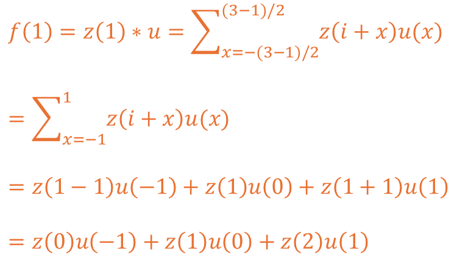
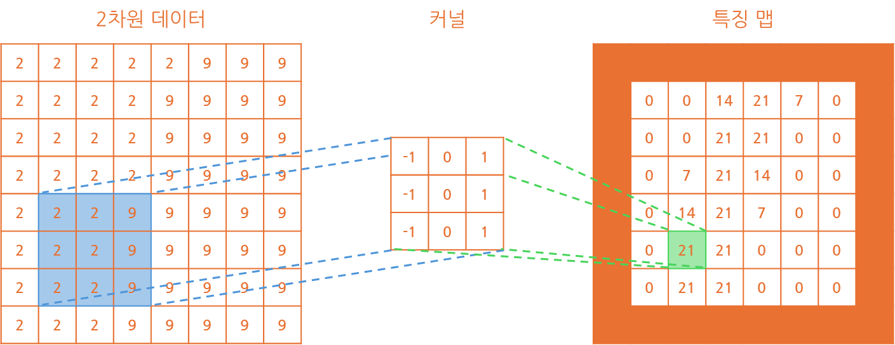

## 📷 합성곱 신경망(Convolution Neural Network)
`합성곱 신경망(Convolution Neural Network)`은 `합성곱`을 이용한 `신경망`으로  
이미지 처리 분야에서 공간에 대한 `특징 추출`에 유리하여 많이 사용되는 형태입니다.

이를 이용하여 `신호 처리`, `이미지 특징 분석`, `컴퓨터 비전` 등에서 사용됩니다.

### 🔢 특징 맵(Feature Map)?
`특징 맵(Feature Map)`은 데이터가 `커널(Kernel)`이라는 `필터(Filter)`를 거치며,  
`선형 결합`을 통해 계산된 결과를 반환한 표 정도로 생각하는 것이 좋다고 생각됩니다.

여기서 `선형 결합`이란 `커널`을 이용하여 데이터의 요소를 곱한 값을 더하는 것입니다.

#### 1️⃣ 1차원 데이터
예를 들어 1x8 크기의 `1차원 데이터`를 1x3 크기의 `커널`을 이용해 계산해볼 경우  
아래와 같이 연산이 수행되어 1x6 크기의 `특징 맵`을 반환하는 것이 확인됩니다.

알 수 있는 것은 `커널` 크기가 1x3이라면 `특징 맵`의 크기가 2개 줄었다는 것과  
`특징 맵`은 1x3인 경우 (-1, 0, 1) 데이터로 이뤄져서 만들어지는 것이 파악됩니다.

규칙으로 인지하신 분도 있겠지만 `커널`은 0을 기준으로 값의 대칭을 이루고 있으며,  
이 값의 대칭을 이루기 위해 `커널`의 크기는 3, 5, 7과 같은 홀수로 구성되고 있습니다.

`1차원 데이터`를 `커널`을 통해 `특징 맵`을 도출하는 수식은 아래와 같이 구성됩니다.

여기서 `z`는 `입력된 데이터`를 `u`는 `커널`을, 마지막으로 `h`는 `커널`의 크기입니다.  
수식에 표에서 제공된 3이라는 `커널`의 크기를 대입하여 계산해보도록 하겠습니다.

`f`가 1인 경우 0번, 1번, 2번에 각각 -1, 0, 1을 곱한 뒤 더하는 것이 확인됩니다.  
이렇게 될 시 `f`가 0이거나 예제 기준 7인 경우 계산이 성립되지 않는게 확인됩니다.

#### 2️⃣ 2차원 데이터
`1차원 데이터`에 대한 구조를 이해했다면 `2차원 데이터`에 대해서도 확인해보겠습니다.

`2차원 데이터`는 8x8 형태이고 `커널`의 크기도 `2차원`의 형태로 3x3 크기로 구성하였습니다.

마찬가지로 확인 가능한 것은 `특징 맵`의 크기가 기존 `데이터`에 비해 작아졌다는 것과  
`커널`이 이전과 비슷하게 ((-1, 0, 1), (-1, 0, 1), (-1, 0, 1)) 형태로 생성됐다는 것입니다.

그렇다면 이러한 형태의 `커널`을 적용하는 수식은 어떻게 구성되는지 살펴보겠습니다.

기존 `1차원 데이터`에서 크게 변화하지는 않았고 수식에 추가만 된 형태가 확인됩니다.  
기존에는 `x` 축만 이용했기에 `x`만 있었지만 이제는 `y` 축의 값도 이용하고 있습니다.

해당 수식에 마찬가지로 `커널`의 크기인 `h` 값에 3을 대입하여 확인해보도록 하겠습니다.

추가로 제가 표현한 `커널`의 경우 오른쪽 값에서 왼쪽 값을 빼는 형태를 띄고 있습니다.  
해당 형태를 `수직 엣지` 라고 표현하고 이는 `수직` 데이터에 대한 `특성`을 추출합니다.

만약 흑백의 밝기를 이용하여 추출할 경우 오른쪽이 밝은 경우 값이 양수로 표현될 것이고,  
반대로 왼쪽이 밝거나 오른쪽이 비교적 어두운 경우 값이 작기 때문에 음수로 표현됩니다.

그렇기에 `수평` 형태 추출이 필요하고 위 값에서 아래 값을 빼는 형태를 만들 수 있습니다.  
이 경우 `수평 엣지`의 `커널`은 ((1, 1, 1), (0, 0, 0), (-1, -1, -1))의 형태를 띄는 걸 알 수 있습니다.

이러한 형태를 이용하여 `이미지`의 경우 색상 영역의 `RGB`를 포함한 다양한 `특성`을 추출합니다.

### 🖼️ 합성곱 층(Convolution Layer)
위에 설명한 `특징맵`을 추출하기 위한 과정이 `합성곱 층(Convolution Layer)`의 역할입니다.

`합성곱 층`에서는 `출력 데이터`를 `유지`하거나 `축소`, 그리고 `바이어스` 값을 주기도 합니다.  
이번 파트에서는 각 방법에 대해서 하나하나 알아보고 계산 방법도 알아보도록 하겠습니다.

#### 💾 패딩(Padding)

#### ✂️ 스트라이드(Stride)

#### ➕ 바이어스(Bias)

### ⏭️ 풀링 층(Pooling Layer)

#### 🎲 부분 연결성

#### ⛹️ 가중치 공유